<p align="center">
  
</p>

<h3 align="center">Everything you wish Jellyfin's web app already did, in one plugin.</h3>

<p align="center">
  Request new movies right from search · Watch shows without spoilers · See 4K, HDR and Atmos on every poster<br>
  Keyboard shortcuts · Bookmarks · A release calendar · Reviews · Live "who's watching" · and a lot more
</p>

<p align="center">
  
  
  
  
  <a href="https://discord.gg/EYNFf7y4CG"></a>
</p>

<p align="center">
  <a href="#-install-in-a-minute"><b>Install</b></a> ·
  <a href="#%EF%B8%8F-the-tour"><b>Tour</b></a> ·
  <a href="https://n00bcodr.github.io/Jellyfin-Enhanced/"><b>Documentation</b></a> ·
  <a href="#-common-questions"><b>FAQ</b></a> ·
  <a href="https://discord.gg/EYNFf7y4CG"><b>Discord</b></a>
</p>

<p align="center">
  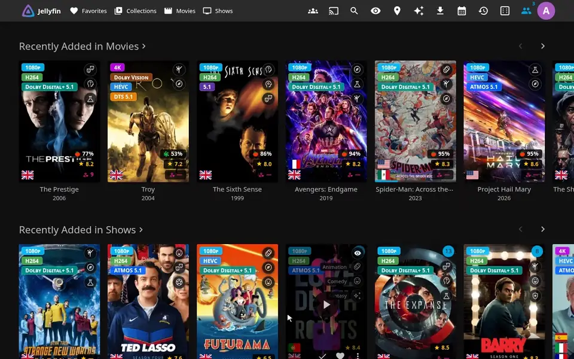
</p>

## 🪼 What is Jellyfin Enhanced?

[Jellyfin](https://jellyfin.org) is a free media server you run yourself, like your own private Netflix. **Jellyfin Enhanced** is a free plugin for that server. It adds dozens of features to the screens you already use in the Jellyfin web app, and in the official Android, iOS and desktop apps (they use the same web interface).

- **Install it once, on the server.** Everyone who uses your server gets the new features. There is nothing to install on phones, TVs or computers.
- **Every person picks what they want.** Press <kbd>?</kbd> anywhere in Jellyfin to open the Enhanced panel and switch features on or off for yourself.
- **Everything is optional.** Out of the box you get the features that need no setup. Connecting [Seerr](https://github.com/seerr-team/seerr), Sonarr, Radarr, TMDB or MDBList adds even more.

<table>
<tr>
<td width="33%" valign="top">

**🍿 For viewers**<br>
<sub>[Poster tags](#%EF%B8%8F-see-quality-at-a-glance) · [Richer movie pages](#-richer-movie-and-show-pages) · [A better player](#%EF%B8%8F-a-better-player) · [Shortcuts](#%EF%B8%8F-the-enhanced-panel-and-shortcuts) · [Random](#-cant-decide)</sub>

</td>
<td width="33%" valign="top">

**👨‍👩‍👧 For households**<br>
<sub>[Spoiler Guard](#-watch-without-spoilers) · [Hide things](#-keep-your-home-screen-tidy) · [Reviews and Activity](#-share-it-with-your-household) · [Phones](#-on-your-phone)</sub>

</td>
<td width="33%" valign="top">

**🛠️ For whoever runs the server**<br>
<sub>[Requests](#-request-anything-right-from-search) · [Calendar](#-see-whats-coming) · [Active Streams](#-see-whos-watching-right-now) · [Admin tools](#%EF%B8%8F-tools-for-the-server-admin)</sub>

</td>
</tr>
</table>

## ⚡ Install in a minute

1. In Jellyfin, open **Dashboard → Plugins → Repositories** and click **➕**.
2. Give it a name (for example `Jellyfin Enhanced`), paste this repository URL, and save:
   ```
   https://raw.githubusercontent.com/n00bcodr/jellyfin-plugins/main/manifest.json
   ```
3. Open the **Catalog** tab, find **Jellyfin Enhanced**, and click **Install**.
4. **Restart** Jellyfin, refresh your browser (<kbd>Ctrl</kbd>+<kbd>F5</kbd>), and press <kbd>?</kbd>. If the Enhanced panel opens, you're done. 🎉

> [!TIP]
> Also install the [File Transformation](https://github.com/IAmParadox27/jellyfin-plugin-file-transformation) plugin from the same Catalog. It prevents file-permission problems on Docker, Windows and Linux.

> [!IMPORTANT]
> Jellyfin Enhanced needs **Jellyfin 10.11 or newer** (12.x and its release candidates included). The same repository URL serves every version, and Jellyfin installs the build that matches your server. Something not working? See the [installation guide](https://n00bcodr.github.io/Jellyfin-Enhanced/installation/installation/) and [troubleshooting](https://n00bcodr.github.io/Jellyfin-Enhanced/installation/troubleshooting/).

## 🗺️ The tour

> Every screenshot and recording below comes from a real Jellyfin 12 server running this plugin.

### 🔎 Request anything, right from search

Search Jellyfin as usual. If what you want isn't on the server yet, it shows up underneath from Seerr, and you can request it with one click. Your request goes to whoever runs the server, who can approve it from inside Jellyfin.

<p align="center">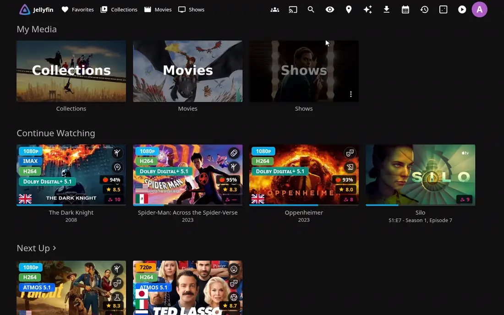</p>

- **Request movies and shows** from search results, detail pages and discovery pages, including **4K** and **specific seasons**.
- **Recommendations and "Similar"** rows on every movie and show page, with request buttons.
- **Browse and discover** by genre, network, studio, actor, collection or tag, plus a **Recommendations** page with trending and popular titles.
- **Automatic requests:** when you're close to the end of a season, the next season is requested for you. The same works for the next movie in a collection.
- **Watchlist sync** between Seerr and Jellyfin, in both directions (uses the [KefinTweaks](https://github.com/ranaldsgift/KefinTweaks) watchlist).
- **Report a problem** (video, audio, subtitles or other) straight to Seerr from the item page.
- **Parental controls are respected.** Results follow each user's rating limit and blocked tags.

<table>
<tr>
<th width="50%">Recommendations page</th>
<th width="50%">Requests, with approve and decline for admins</th>
</tr>
<tr>
<td>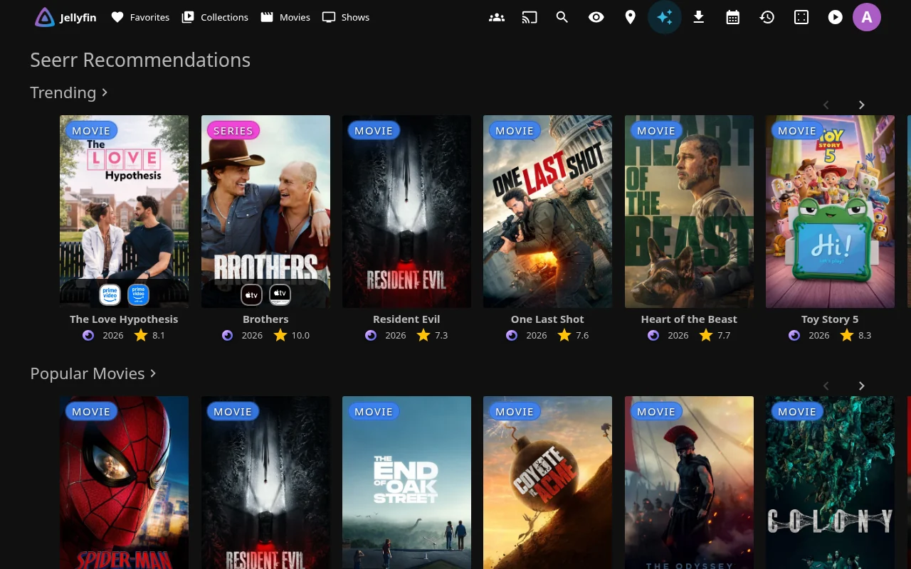</td>
<td>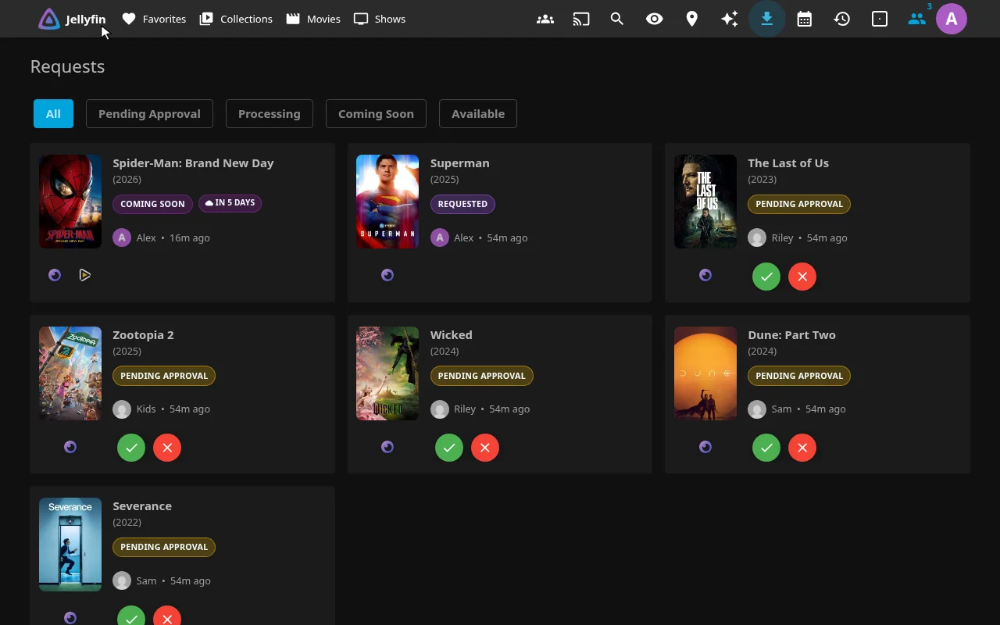</td>
</tr>
</table>

<sub>Needs a [Seerr](https://github.com/seerr-team/seerr) server. · [Seerr docs →](https://n00bcodr.github.io/Jellyfin-Enhanced/seerr/seerr-features/)</sub>

### 🫣 Watch without spoilers

Turn on **Spoiler Guard** for a show, movie or collection. Until you've watched an episode, its thumbnail is blurred, and its title, plot, rating, chapter names and guest stars are hidden. Everything you've already watched looks normal.

<p align="center">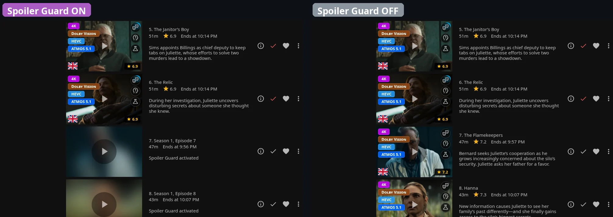</p>

- It runs **on the server**, so it protects **every** Jellyfin app, including TV apps, Swiftfin, Findroid and Streamyfin.
- It's **per person**: turning it on for yourself doesn't change anything for anyone else.
- It also covers **trickplay previews** when you scrub the timeline, the **chapter list**, **search results** and **reviews**.
- Admins can turn it on automatically when someone starts a new show or requests one.

<details>
<summary>▶️ See it in action</summary>
<p align="center">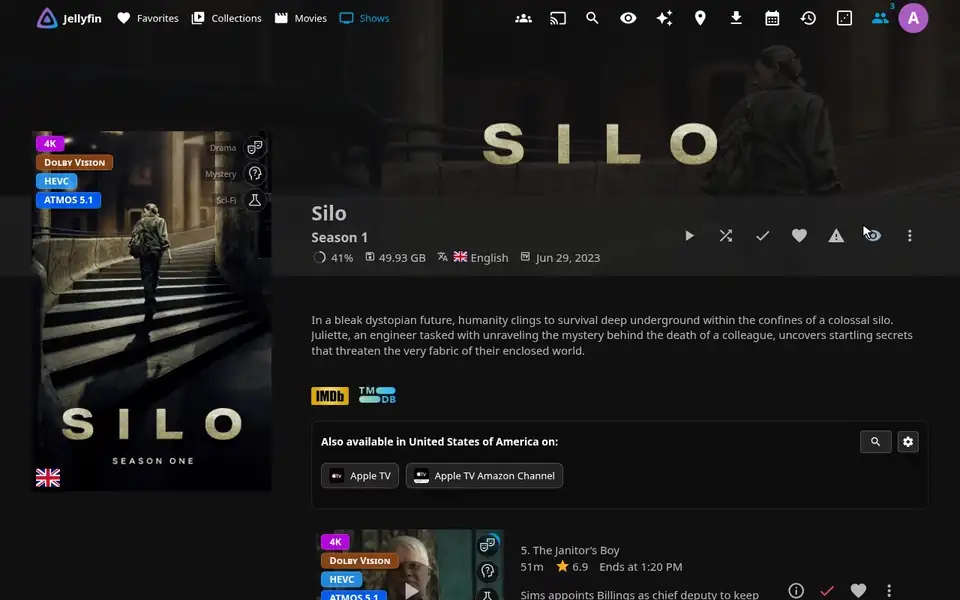</p>
</details>

<sub>[Spoiler Guard docs →](https://n00bcodr.github.io/Jellyfin-Enhanced/spoiler-guard/spoiler-guard-features/)</sub>

### 🏷️ See quality at a glance

Every poster gets small badges, so you can tell at a glance what you're about to watch.

<p align="center">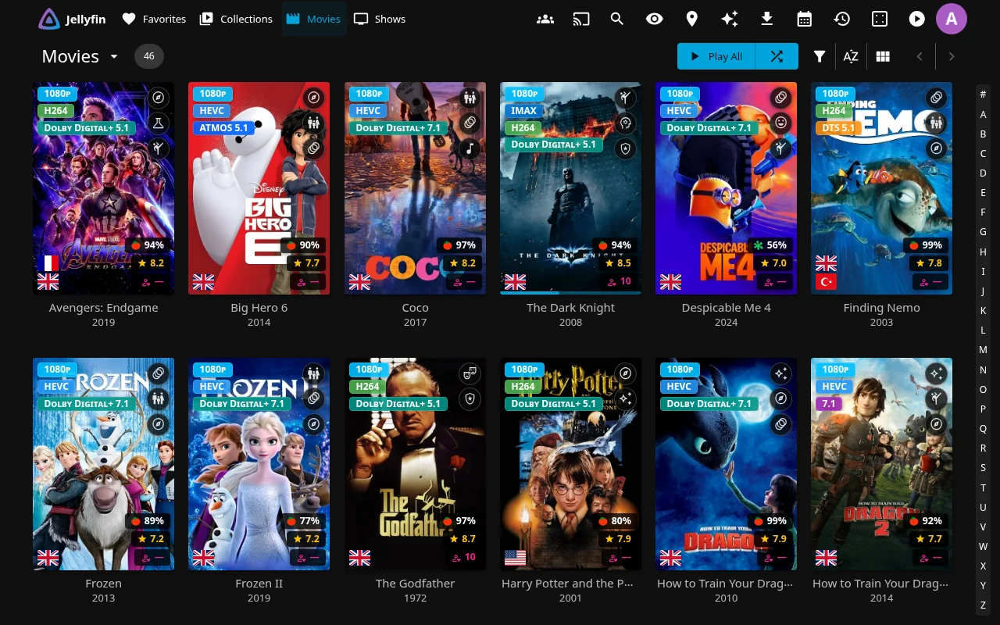</p>

| Badge | What it shows |
|---|---|
| **Quality** (top left) | Resolution (8K, 4K, 1080p…), HDR, Dolby Vision, HDR10+, codec, and audio such as Atmos, DTS:X, TrueHD and 7.1 |
| **Genre** (top right) | Icons for up to three genres, which expand into their names when you hover |
| **Language** (bottom left) | A flag for each audio language |
| **Ratings** (bottom right) | TMDB and Rotten Tomatoes scores, plus (optionally) the average rating from people on your server |
| **People** (cast photos) | Each actor's age now and at release, and their birthplace |

<p align="center">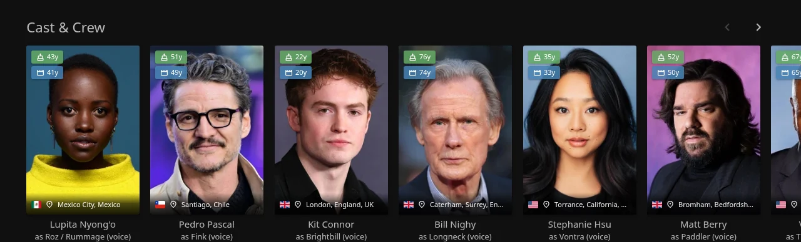</p>

<sub>You can move, restyle or hide every badge. · [Tag docs →](https://n00bcodr.github.io/Jellyfin-Enhanced/enhanced/enhanced-features/#visual-enhancements)</sub>

### 📄 Richer movie and show pages

<table>
<tr>
<td width="50%">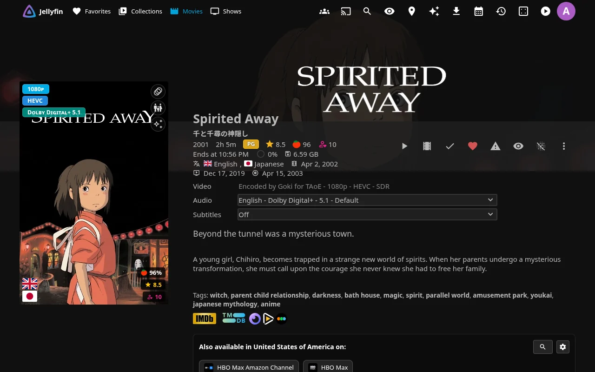</td>
<td width="50%">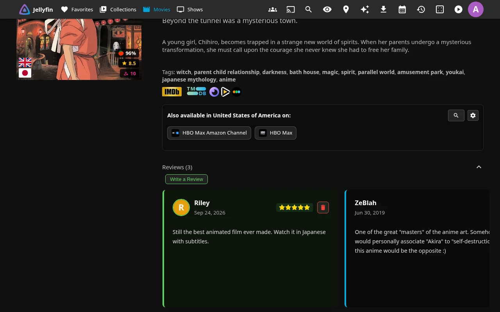</td>
</tr>
</table>

- **Ratings** from TMDB and Rotten Tomatoes, plus IMDb, Letterboxd, Metacritic, Trakt and more through [MDBList](https://mdblist.com)
- **Elsewhere:** where the title is streaming, for rent or for sale, in any country
- **Reviews:** TMDB reviews, and **reviews and star ratings written by people on your server**
- **Awards:** Oscars, Golden Globes, BAFTAs, Emmys and more, for movies, shows and people
- **Extra details** such as release dates (cinema, digital and physical for movies, air dates for shows), file size, watch progress and audio languages
- **Quick links** to Letterboxd, and (for admins) to the title in Sonarr, Radarr or Bazarr

<p align="center">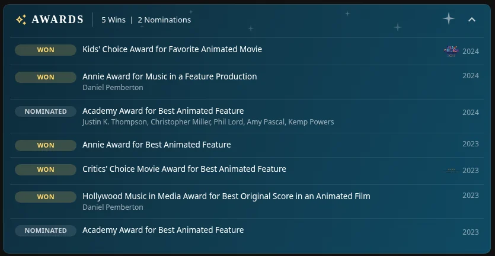</p>

<sub>Streaming availability and TMDB reviews need a free TMDB API key, and extra ratings need a free MDBList key. · [Elsewhere docs →](https://n00bcodr.github.io/Jellyfin-Enhanced/elsewhere/elsewhere-features/)</sub>

### ⏯️ A better player

<p align="center">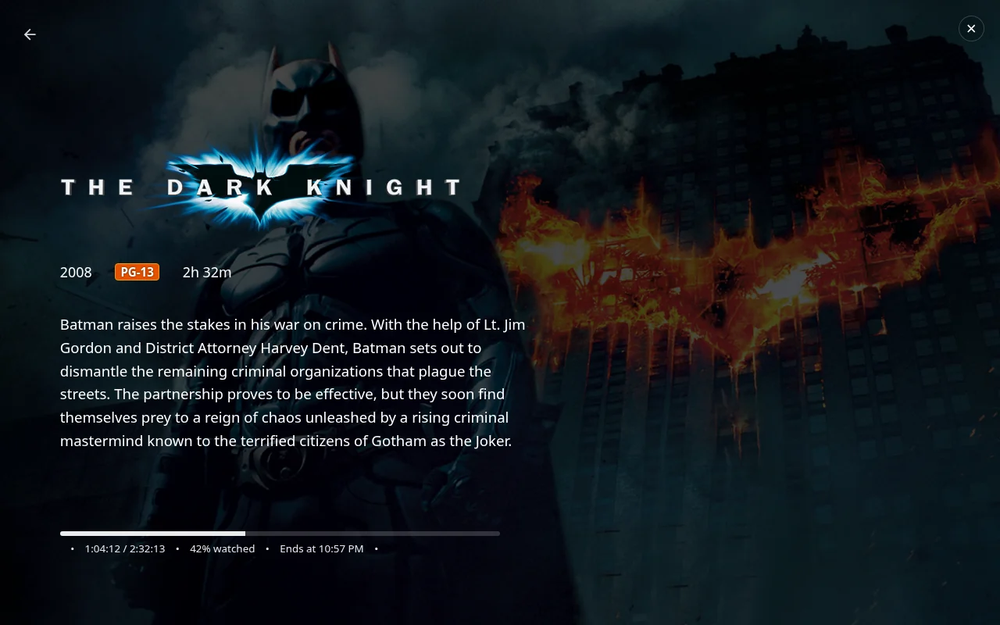</p>

- A **pause screen** with the title, plot, rating and how far you are through it
- **Bookmarks:** press <kbd>B</kbd> to save a moment. It appears as a marker on the timeline, and every bookmark is listed on its own page.
- **Automatic intro and outro skipping**, using the intro data Jellyfin already has (for example from [Intro Skipper](https://github.com/intro-skipper/intro-skipper))
- **Auto-pause** when you switch browser tabs, **auto-resume** when you come back, and optional picture-in-picture
- **Custom subtitles:** font, size, color, background and position, with a live preview
- **Press and hold the video for 2× speed** (mouse or touch)
- **Ratings in the player** while the controls are showing

<table>
<tr>
<th width="50%">Bookmarks on the timeline</th>
<th width="50%">All your bookmarks in one place</th>
</tr>
<tr>
<td>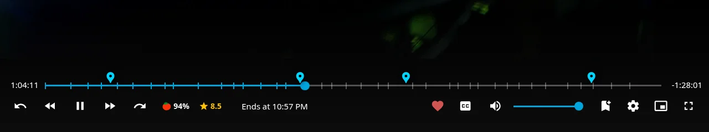</td>
<td>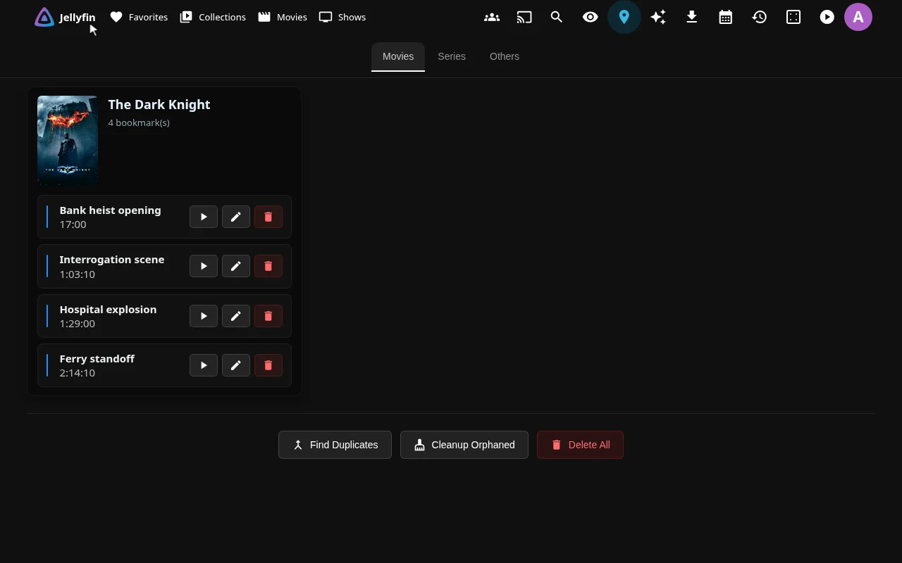</td>
</tr>
</table>

<sub>[Playback docs →](https://n00bcodr.github.io/Jellyfin-Enhanced/enhanced/enhanced-features/#playback-controls)</sub>

### ⌨️ The Enhanced panel and shortcuts

Press <kbd>?</kbd> anywhere to open your personal settings panel. It's also where you change keyboard shortcuts: click a key and press a new one.

<p align="center">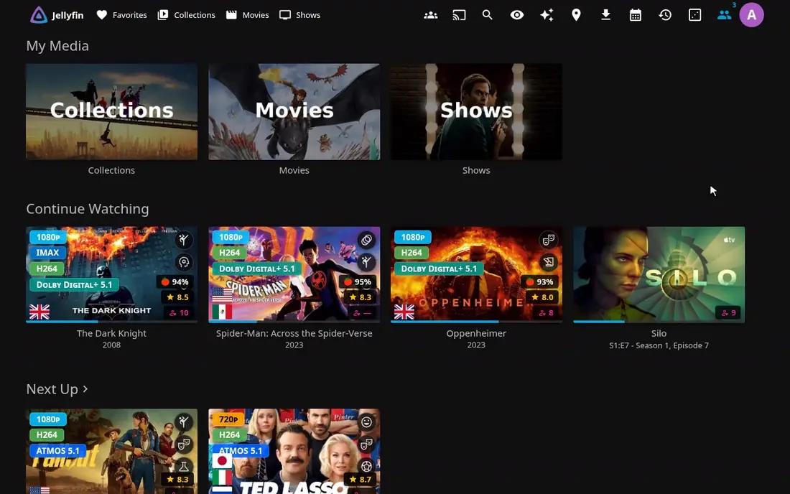</p>

<details>
<summary>⌨️ Default keyboard shortcuts</summary>

| Anywhere | | In the player | |
|---|---|---|---|
| <kbd>/</kbd> | Search | <kbd>B</kbd> | Bookmark this moment |
| <kbd>Shift</kbd>+<kbd>H</kbd> | Home | <kbd>O</kbd> | Skip intro or outro |
| <kbd>D</kbd> | Dashboard | <kbd>S</kbd> / <kbd>C</kbd> | Subtitle menu / next subtitle track |
| <kbd>Q</kbd> | Quick Connect | <kbd>V</kbd> | Next audio track |
| <kbd>R</kbd> | Play something random | <kbd>+</kbd> / <kbd>-</kbd> / <kbd>R</kbd> | Faster / slower / normal speed |
| <kbd>?</kbd> | Open the Enhanced panel | <kbd>A</kbd> | Change aspect ratio |
| | | <kbd>I</kbd> | Playback info |
| | | <kbd>P</kbd> | Episode preview |
| | | <kbd>,</kbd> / <kbd>.</kbd> | Back or forward one frame |
| | | <kbd>Z</kbd> | Jump back to where you were |
| | | <kbd>0</kbd>–<kbd>9</kbd> | Jump to 0–90% of the video |

</details>

### 🙈 Keep your home screen tidy

<table>
<tr>
<th width="50%">Remove from Continue Watching</th>
<th width="50%">Hide a title everywhere</th>
</tr>
<tr>
<td>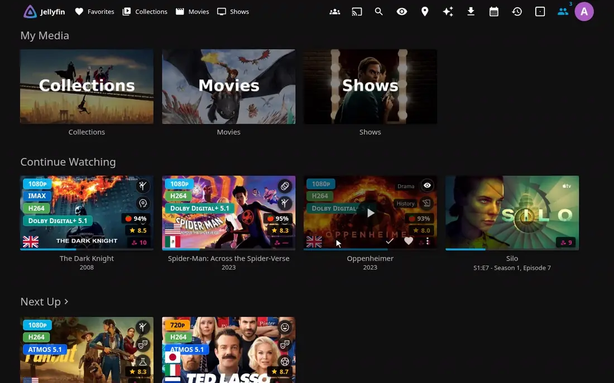</td>
<td>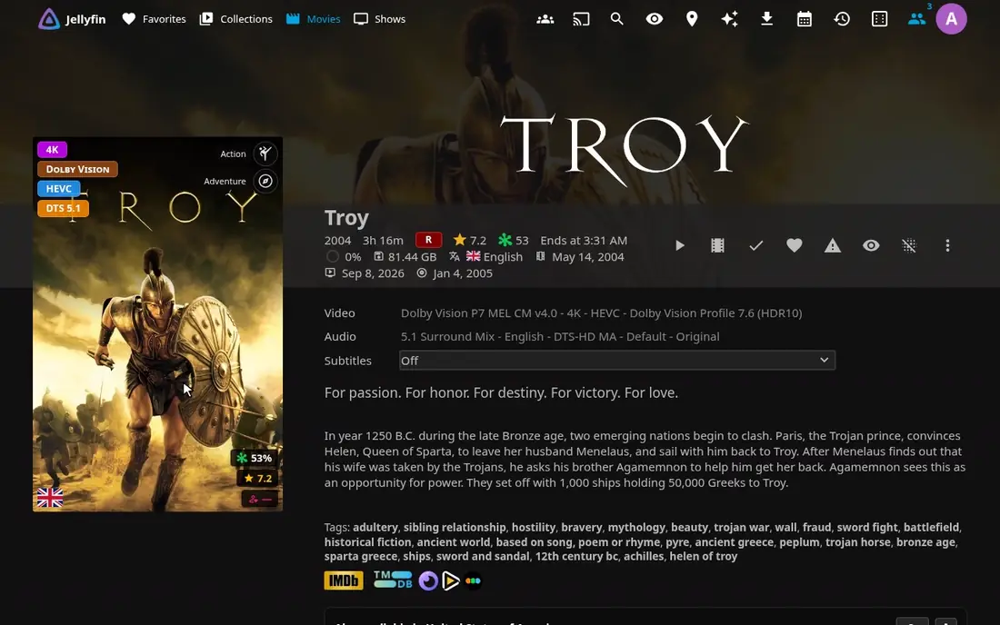</td>
</tr>
</table>

- **Remove** things from **Continue Watching** or **Next Up** without losing your place. Start watching again and the title comes back by itself.
- **Hide** anything you never want to see, from the library, search, recommendations, the calendar and more.
- Your hidden list is **saved on the server and private to you** (admins can manage it), so it follows you to every device. Manage it, and unhide things, on the **Hidden Content** page.

<sub>[Hidden content docs →](https://n00bcodr.github.io/Jellyfin-Enhanced/enhanced/enhanced-features/#content-management)</sub>

### 📅 See what's coming

A **Calendar** shows upcoming episodes and movies from Sonarr and Radarr, in day, week, month or agenda view. You can filter by cinema, digital or physical release, see what's already available, and optionally highlight shows you've favorited or watched.

<p align="center">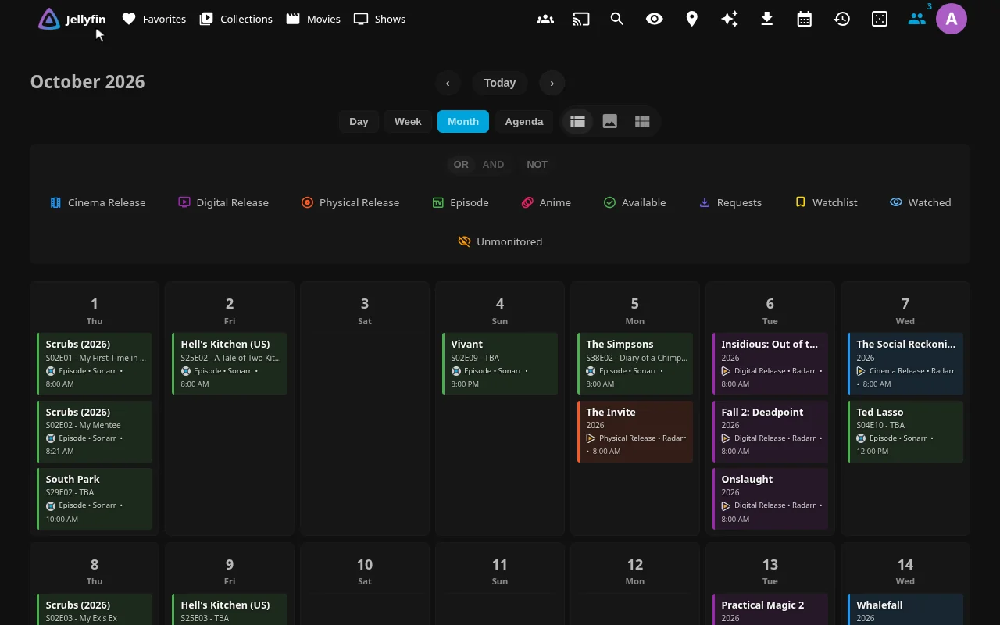</p>

The **Requests** page shows every Seerr request and what's downloading right now, with progress bars, so nobody has to ask "is it ready yet?"

<sub>Needs Sonarr and/or Radarr. · [*arr docs →](https://n00bcodr.github.io/Jellyfin-Enhanced/arr/arr-features/)</sub>

### 👥 Share it with your household

<table>
<tr>
<td width="50%">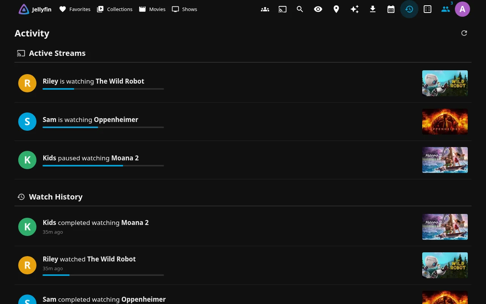</td>
<td width="50%" valign="top">

- **Activity:** see what everyone is watching right now, and what they recently watched, favorited and reviewed. People only see activity for titles they have access to.
- **Reviews and ratings:** anyone can rate a movie, show, season or episode and write a review. The average appears on detail pages, and optionally on posters.
- **Login screen avatars:** everyone's profile picture on the sign-in screen.

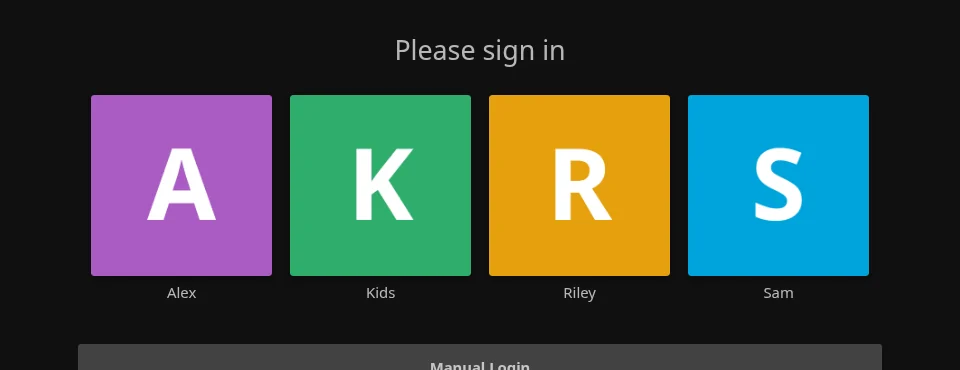

</td>
</tr>
</table>

### 📡 See who's watching right now

A live counter in the header shows how many people are watching. Click it for everyone's poster, progress and device, and whether each stream is playing directly or being transcoded (with codec and bitrate). Admins can also send a message to everyone who's connected. Only admins see the counter unless you choose to show it to everyone.

<p align="center">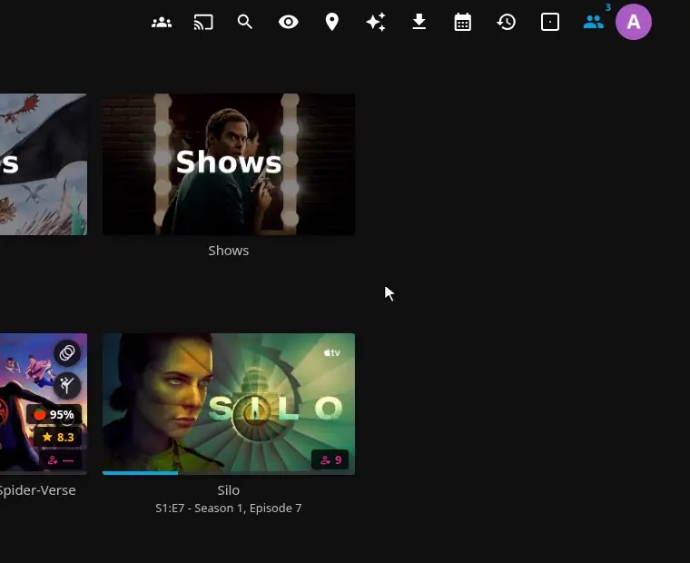</p>

### 🎲 Can't decide?

The **Random** button (or <kbd>R</kbd>) picks something from your library. You can limit it to movies, shows or things you haven't watched yet.

<p align="center">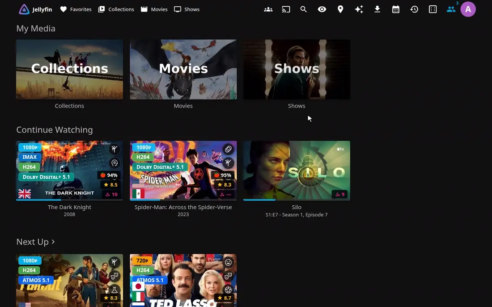</p>

### 📱 On your phone

Everything works in the official Jellyfin apps for Android and iOS, and in Jellyfin 12's layout on any phone browser. The header adapts to small screens.

<p align="center">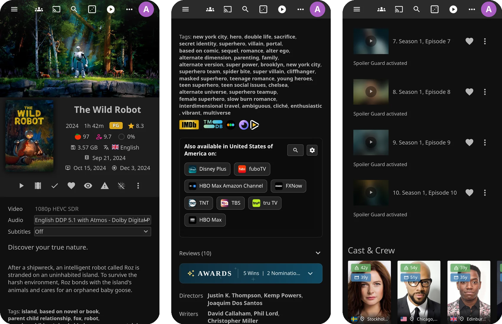</p>

### 🛠️ Tools for the server admin

<table>
<tr>
<td width="50%">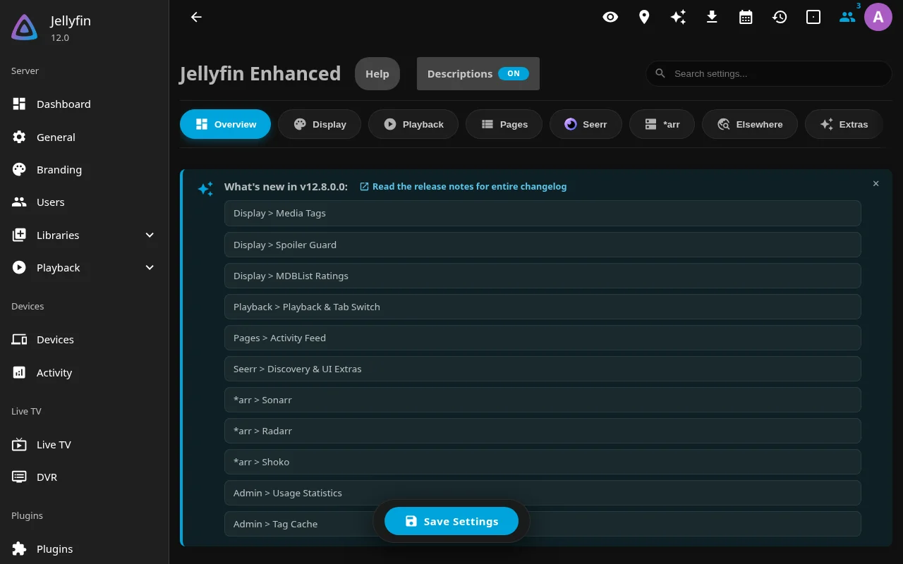</td>
<td width="50%" valign="top">

Everything is configured from **Dashboard → Plugins → Jellyfin Enhanced**, with search, descriptions for every option and highlights of the new settings after each update.

- **Set defaults** for everyone, or overwrite everyone's personal settings in one click
- **Import Jellyfin users into Seerr**, and **audit** who is allowed to request what
- **Sonarr, Radarr and Bazarr links**, and \*arr tags shown on items
- **Check which parts are working** with built-in connection tests

</td>
</tr>
</table>

- **Maintenance mode:** a banner on the login page, and optionally lock out everyone except admins while you work.

  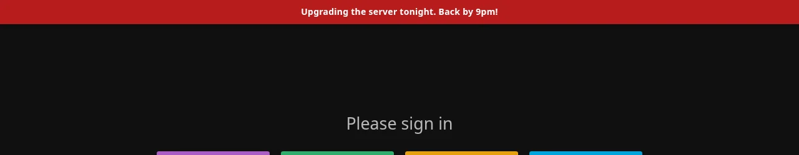

- **Your own branding:** upload a logo, banners, favicon and loading screen
- **Themes:** pick a color theme (or a random one each day), plus colored activity and plugin icons
- **Documented CSS hooks** to restyle any part of the plugin
- **Translated into 20+ languages** by the community

<sub>[Admin & other features →](https://n00bcodr.github.io/Jellyfin-Enhanced/other/other-features/)</sub>

<p align="center"><b><a href="https://n00bcodr.github.io/Jellyfin-Enhanced/enhanced/enhanced-features/">📖 Read the full feature guide →</a></b></p>

## 📱 Where it works

| App | What you get |
|---|---|
| Jellyfin web, in any browser | ✅ Everything |
| Official Android and iOS apps | ✅ Everything (they use the web interface) |
| Jellyfin Desktop v3.0.0+ (currently unreleased) | ✅ Everything |
| Android TV, Roku, Swiftfin, Findroid, Streamyfin and other apps | ⚠️ Only the features that run on the server: **Spoiler Guard**, **hidden content** (including Continue Watching / Next Up removals), **automatic Seerr requests**, **maintenance mode** and admin messages |

## 🧩 Works great with

| Plugin or app | Why |
|---|---|
| [File Transformation](https://github.com/IAmParadox27/jellyfin-plugin-file-transformation) | Recommended for every install. Prevents file-permission errors. |
| [Seerr](https://github.com/seerr-team/seerr) | Powers requests, discovery, recommendations and watchlist sync. |
| Sonarr / Radarr / Bazarr | Power the Calendar, the Requests page's download progress, and admin links. |
| [Intro Skipper](https://github.com/intro-skipper/intro-skipper) | Finds the intros and outros that auto-skip jumps over. |
| [Plugin Pages](https://github.com/IAmParadox27/jellyfin-plugin-pages) / [Custom Tabs](https://github.com/IAmParadox27/jellyfin-plugin-custom-tabs) | Optional. Put the Calendar, Requests, Activity and other pages in the sidebar or as home tabs. Built-in home tabs work without them. |
| [KefinTweaks](https://github.com/ranaldsgift/KefinTweaks) | Provides the watchlist that watchlist sync uses. |
| [Jellyfish](https://github.com/n00bcodr/Jellyfish/) | A Jellyfin theme by the same author, which the theme selector builds on. |

## ❓ Common questions

<details>
<summary><b>Does it work on my TV?</b></summary>

Partly. Most features live in Jellyfin's web interface, so you get all of them in browsers, the official Android and iOS apps, and Jellyfin Desktop v3.0.0+. Native TV apps and other apps like Swiftfin, Findroid and Streamyfin don't use that interface. They still get the features that run on the server: Spoiler Guard, hidden content (including Continue Watching / Next Up removals), automatic Seerr requests, maintenance mode and admin messages.

</details>

<details>
<summary><b>Do I need Seerr, Sonarr or Radarr?</b></summary>

No. Without them you still get tags, shortcuts, the pause screen, bookmarks, Spoiler Guard, reviews, the Activity page, hidden content, themes and much more. The request, calendar and download features appear only after you connect them.

</details>

<details>
<summary><b>Will it mess up my server or my watch history?</b></summary>

No. It doesn't touch your media files. Removing something from Continue Watching keeps your progress, and hidden titles can be unhidden at any time. To uninstall, remove the plugin under **Dashboard → Plugins** and restart.

</details>

<details>
<summary><b>Is it free?</b></summary>

Yes. It's open source under [GPL-3.0](LICENSE). If you'd like to say thanks, there's [Ko-fi](https://ko-fi.com/n00bcodr) and [Buy Me a Coffee](https://www.buymeacoffee.com/n00bcodr).

</details>

<details>
<summary><b>Is it in my language?</b></summary>

Probably. It's translated into more than 20 languages and follows the language set in your Jellyfin profile. Missing yours? [Help translate on Weblate](https://hosted.weblate.org/engage/jellyfinenhanced/). No coding needed.

</details>

<details>
<summary><b>Is this made by Jellyfin or Seerr?</b></summary>

No. It's a community project by [n00bcodr](https://github.com/n00bcodr) and contributors. Please report problems **here**, not to Jellyfin or Seerr.

</details>

More answers are in the [full FAQ](https://n00bcodr.github.io/Jellyfin-Enhanced/faq-support/faq/).

## 💬 Help, feedback and translations

- **Stuck?** Read the [FAQ](https://n00bcodr.github.io/Jellyfin-Enhanced/faq-support/faq/) or ask on [Discord](https://discord.gg/EYNFf7y4CG).
- **Found a bug?** [Open an issue](https://github.com/n00bcodr/Jellyfin-Enhanced/issues).
- **Have an idea?** [Start a discussion](https://github.com/n00bcodr/Jellyfin-Enhanced/discussions).
- **Speak another language?** [Help translate on Weblate](https://hosted.weblate.org/engage/jellyfinenhanced/).
- **Want to contribute code?** Start with [CONTRIBUTING.md](CONTRIBUTING.md).

<p align="center">
  <a href="https://hosted.weblate.org/engage/jellyfinenhanced/"></a>
</p>

<details>
<summary><b>More from n00bcodr</b></summary>

- [Jellyfish](https://github.com/n00bcodr/Jellyfish/): a custom Jellyfin theme
- [Jellyfin Tweaks](https://github.com/n00bcodr/JellyfinTweaks): a plugin with extra tweaks
- [Jellyfin JavaScript Injector](https://github.com/n00bcodr/Jellyfin-JavaScript-Injector): adds your own scripts to Jellyfin
- [Kefin Tweaks](https://github.com/ranaldsgift/KefinTweaks) (by ranaldsgift): watchlist and more

</details>

## ⭐ Star history

<a href="https://www.star-history.com/?repos=n00bcodr%2FJellyfin-Enhanced&type=date&legend=top-left">
 <picture>
   <source media="(prefers-color-scheme: dark)" srcset="https://api.star-history.com/chart?repos=n00bcodr/Jellyfin-Enhanced&type=date&theme=dark&legend=top-left&sealed_token=dHVltYjTopyABWuSHsm1qmc7Q72ljM73fNCmKNNTqhJRqfngH-60EOzWJlfunX3xrqZimaAQdy3reRT1DWP_qt8ruMBd0LwddO1DZnX5ns00uOrFW9z82w" />
   <source media="(prefers-color-scheme: light)" srcset="https://api.star-history.com/chart?repos=n00bcodr/Jellyfin-Enhanced&type=date&legend=top-left&sealed_token=dHVltYjTopyABWuSHsm1qmc7Q72ljM73fNCmKNNTqhJRqfngH-60EOzWJlfunX3xrqZimaAQdy3reRT1DWP_qt8ruMBd0LwddO1DZnX5ns00uOrFW9z82w" />
   
 </picture>
</a>

---

<div align="center">

**If Jellyfin Enhanced made your server better, please ⭐ star the repo. It helps other people find it.**

<a href='https://ko-fi.com/G2G51TIZF0' target='_blank'></a>
<a href='https://www.buymeacoffee.com/n00bcodr' target='_blank'></a>

Licensed under [GPL-3.0](LICENSE) · Made with 💜 for Jellyfin and the community

</div>
