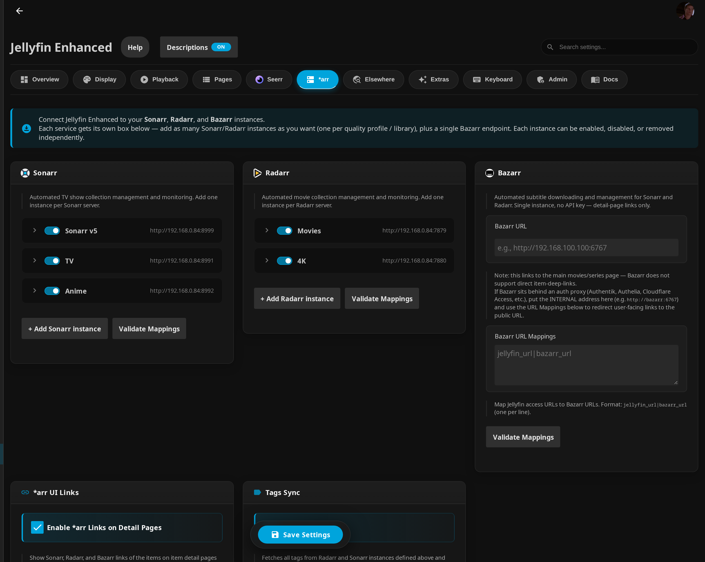

# *arr Settings

Configuration reference for the Sonarr/Radarr/Bazarr links, tag sync, and the Calendar and Requests pages.



!!! info "Visibility"
    The ***arr links** on item detail pages are **admin only**. The **Calendar** and **Requests** pages and the **tag links** are available to all users, with events and downloads filtered by each user's library access / requests.

## Setup

1. Open plugin settings → **`*arr`** tab
2. Add one or more Sonarr and/or Radarr instances (and optionally a Bazarr URL)
3. Enable **`Enable *arr Links on Detail Pages`**
4. Optional: Enable **`Enable Tags Sync`** and **`Show synced tags as links`**
5. Configure tag filters (show/hide filters are one tag per line; the sync filter is comma/semicolon-separated)

!!! info "Where the settings live"
    Sonarr/Radarr/Bazarr instances, **\*arr UI Links**, and **Tags Sync** are on the **\*arr** tab. The **Calendar Page** and **Requests Page** settings documented further down live on the separate **Pages** tab.

### CSS Customization
See [*arr Tag Links CSS](../advanced/css-customization.md#arr-tag-links) for styling options.

---

## Multi-Instance Configuration

### Instance Fields

Each Sonarr or Radarr instance has the following fields:

| Field | Required | Description |
|---|---|---|
| **Name** | Yes | Display name shown in dropdowns (e.g., `TV Shows`, `Anime`, `4K Movies`) |
| **URL** | Yes | Base URL of the instance (e.g., `http://192.168.1.100:8989`) |
| **API Key** | Yes | API key from the instance's Settings → General page |
| **URL Mappings** | No | Per-instance URL remapping for reverse-proxy setups |
| **Enabled** | — | Toggle to disable without deleting; defaults to on |

### Adding an Instance

1. Open plugin settings → the ***arr** tab
2. Click **"Add Sonarr Instance"** or **"Add Radarr Instance"**
3. Fill in Name, URL, and API Key
4. Optionally add URL Mappings
5. Click **Save**

### Disabling an Instance

Toggle the **Enabled** switch off to skip an instance in all fan-out paths (arr links, calendar, queue monitoring, tag sync) without removing its configuration. Re-enable it at any time.

!!! tip
    Use the Enabled toggle during maintenance windows or when temporarily replacing an instance. Your URL and API key are preserved.

### URL Mappings (per-instance)

URL mappings swap the link target based on **how you are accessing Jellyfin** (LAN vs. remote / reverse proxy). Each line maps a Jellyfin address to the *arr address that should be used when Jellyfin is reached at that address:

```text
jellyfin_url|arr_url
```

**Example:**
```text
https://jellyfin.example.com|https://anime.example.com
http://192.168.1.50:8096|http://sonarr-anime:8989
```

**Matching:** the plugin compares the current Jellyfin server address (trailing slash and case ignored) against the left side of each line; the first match wins, and if nothing matches the instance's base **URL** is used. Per-instance mappings apply only to their own instance; the legacy single-instance setup uses the global `SonarrUrlMappings` / `RadarrUrlMappings` fields, and Bazarr uses `BazarrUrlMappings`.

---

## Link Behaviour

### Matching

A series is matched to instances by **TVDB ID**; a movie by **TMDB ID**. The backend queries every enabled instance and only the instances that actually contain the item appear in the link or dropdown.

### Single Instance

When only one instance matches an item, the link renders as a plain icon (no badge). To also show the status colour border and episode/file count on single-instance links, enable:

> **"Show status badge for single-instance"**

### Multiple Instances (Dropdown)

When more than one instance contains the item, the link becomes a dropdown (with a ▾ arrow). Each entry shows:

- A colour-coded status dot
- Instance name
- Episode count (Sonarr, e.g. `22/41`) or download status (Radarr: `Downloaded` / `Missing`)
- File size on disk

**Status colours:**

| Colour | Hex | Meaning |
|---|---|---|
| Green | `#52b54b` | Complete — all episodes present / movie file downloaded |
| Amber | `#e5a00d` | Partial — some episodes missing |
| Grey | `#666` | Missing — no file present in that instance |

---

## Legacy Single-Instance Fields

The original `SonarrUrl`, `SonarrApiKey`, `RadarrUrl`, and `RadarrApiKey` fields are preserved for downgrade safety. If the multi-instance list is empty, the plugin falls back to these fields automatically.

!!! note
    Once you add instances via the new UI, the legacy fields are no longer used for arr links. They are not deleted, so downgrading to an older plugin version restores single-instance behaviour.

---

## *arr UI Links Settings

Found on the ***arr** tab under "*arr UI Links". These links are **admin only**.

| Setting | Description |
|---|---|
| **Enable *arr Links on Detail Pages** | Shows Sonarr/Radarr/Bazarr links on item detail pages. A service with no URL configured is simply not shown. |
| **Show links as text** | Renders the links as plain text labels instead of icon buttons. |
| **Show status badge for single-instance** | When off (default), a single matching instance renders as a plain icon/text. When on, it also shows the episode count (e.g. `22/41`) and a coloured left border for download status. Multi-instance dropdowns always show this detail regardless of the toggle. |

---

## Tags Sync Settings

Found on the ***arr** tab under "Tags Sync". Tags are pulled from the Sonarr/Radarr instances defined above (movies matched by **TMDB ID**, series by **IMDb ID**).

| Setting | Description |
|---|---|
| **Enable Tags Sync** | Lets the scheduled task fetch tags from your *arr instances and add them to Jellyfin items as metadata tags. |
| **Tag Prefix** | Prefix added to every synced tag. Default: `JE Arr Tag: ` (e.g. `JE Arr Tag: 1 - Jellyfish`). |
| **Clear old tags before sync** | Removes existing tags starting with the prefix before adding the current set, keeping Jellyfin in sync with *arr. |
| **Show synced tags as links** | Displays prefixed tags as clickable links on item detail pages (useful if your theme hides tags). |
| **Sync to Jellyfin Filter** | Tag names (without prefix), separated by **commas or semicolons**. (The field's "One per line" placeholder is misleading — the sync task splits on `,`/`;`, not line breaks.) Only listed tags are synced; empty = sync all. |
| **Show as Links Filter** | One tag name per line (without prefix). Only listed tags render as links; empty = show all prefixed tags. |
| **Hide Specific Links Filter** | One tag name per line (without prefix). Listed tags are never shown as links. **Takes priority over the Show filter.** |

!!! note "Running the sync"
    Tag sync has **no default schedule**. After enabling it, run it from **Dashboard → Scheduled Tasks → "Sync Tags from *arr to Jellyfin"** and add a trigger so new items are tagged automatically. Every instance URL is validated against an SSRF allow-list before any request is made.

---

## Calendar Page Settings

Found on the **Pages** tab under "Calendar Page".

| Setting | Description |
|---|---|
| **Enable Calendar Page** | Adds a "Calendar" link to the navigation showing upcoming Sonarr/Radarr releases. |
| **Use Plugin Pages** | Replaces the default Calendar page with a [Plugin Pages](https://github.com/IAmParadox27/jellyfin-plugin-pages) implementation (sidebar link; restart Jellyfin the first time). |
| **Use Custom Tabs** | Adds a [Custom Tabs](https://github.com/IAmParadox27/jellyfin-plugin-custom-tabs) entry. |
| **Add the Custom Tabs entry for me** | When on (and Custom Tabs is enabled), the plugin creates/removes the matching Custom Tabs entry automatically on save. |
| **First Day of Week** | Sunday through Saturday — which day is the first grid column. Default: **Monday**. |
| **Time Format** | `5pm/5:30pm` (12-hour, default) or `17:00/17:30` (24-hour). |
| **Highlight Favorites/Watchlist** | Golden border on entries for Jellyfin favorites; also adds a **Watchlist** filter chip. |
| **Highlight Watched Series** | Border on entries for series you've watched episodes from; also adds a **Watched** filter chip. |
| **Filter by Library Access** | When on (default), each user only sees items from libraries they can access; upcoming items not yet in Jellyfin are filtered by their Sonarr/Radarr root folder. This makes the calendar safe for non-admin users. |
| **Show Requested Only (Default)** | Calendar loads showing only Jellyseerr-requested items, but the user can change filters. Requires Jellyseerr enabled. |
| **Force Only Requested Items** | Calendar always shows only requested items and the **Requests** filter chip is hidden (user cannot disable it). Requires Jellyseerr enabled. |

After enabling with Plugin Pages, restart Jellyfin for the sidebar link to appear.

Direct URL hash route: `#/calendar`

---

## Requests Page Settings

Found on the **Pages** tab under "Requests Page". The page is labelled **Requests** in the navigation and shows the *arr download queue plus optional Jellyseerr requests/issues.

| Setting | Description |
|---|---|
| **Enable Requests Page** | Adds a "Requests" link to the navigation showing active downloads and requests. |
| **Show Downloads in Requests Page** | When on (default), shows the active Sonarr/Radarr download queue on the Requests page (requires *arr links and API keys configured). |
| **Filter Downloads by User Requests** | When on (default), non-admin users only see downloads for content they requested. When off, all authenticated users see the entire queue. |
| **Show Seerr Issues Section** | Shows open/resolved Seerr issues beneath the requests (requires Jellyseerr enabled). |
| **Use Plugin Pages for Requests** | Replaces the default Requests page with a [Plugin Pages](https://github.com/IAmParadox27/jellyfin-plugin-pages) implementation (restart Jellyfin the first time). |
| **Use Custom Tabs for Requests** | Adds a [Custom Tabs](https://github.com/IAmParadox27/jellyfin-plugin-custom-tabs) entry. |
| **Add the Custom Tabs entry for me** | Creates/removes the matching Custom Tabs entry automatically on save. |
| **Enable Auto-Refresh** | Periodically refreshes the page so download progress updates without a manual reload. Polling pauses while the page/tab is hidden. |
| **Poll Interval (seconds)** | How often to auto-refresh, in seconds. Minimum **30**, maximum **300**, default **30**. Applies only when auto-refresh is enabled. |

!!! note
    The download/requests queue on this page is separate from the Seerr search experience. The Jellyseerr **Requests** and **Issues** sections only appear here when Jellyseerr is enabled in the **Seerr** tab.

Direct URL hash route: `#/downloads`
