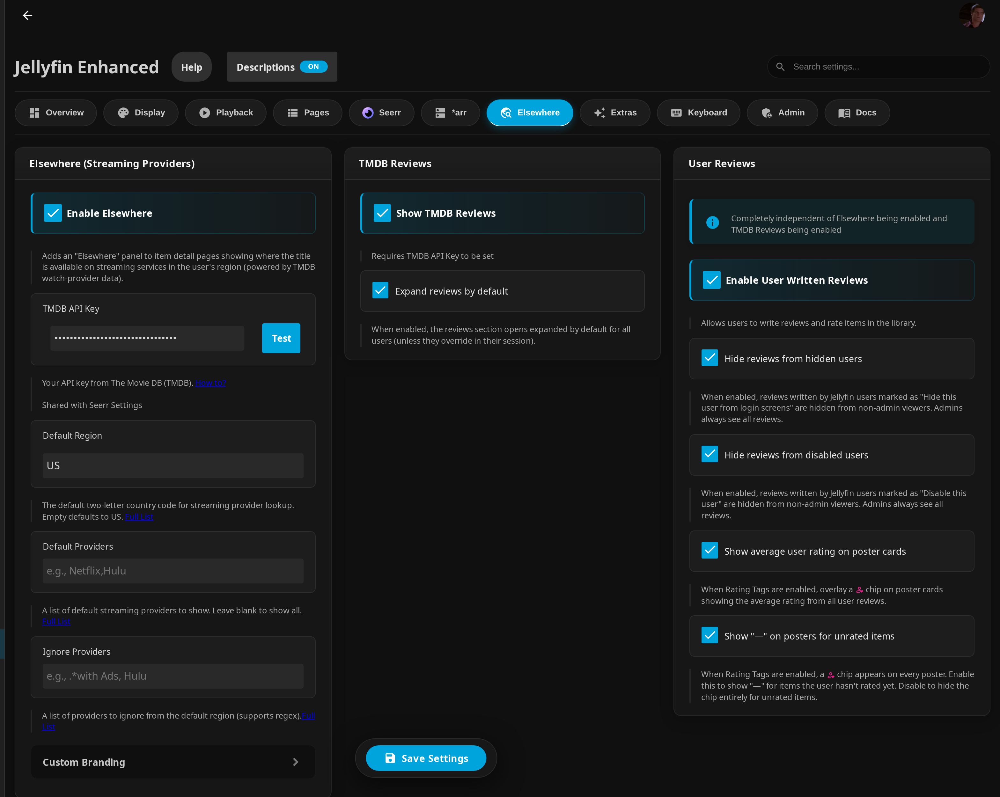

# Elsewhere Settings



!!! info "Prerequisites"

    **Prerequisites:**

    - **TMDB API Key** (for Streaming Providers and TMDB Reviews)
        - [Free from TMDB](https://www.themoviedb.org/settings/api)
    - **Jellyfin Enhanced** plugin installed

    User Reviews do **not** require a TMDB API key.

All of these settings live on the **Elsewhere** tab of the plugin configuration page (**Dashboard → Plugins → Jellyfin Enhanced → Elsewhere**). The tab has three sections: **Elsewhere (Streaming Providers)**, **TMDB Reviews**, and **User Reviews**.

## Prerequisites

### Getting a TMDB API Key

1. Create a free account at [TMDB](https://www.themoviedb.org/)
2. Go to [Settings → API](https://www.themoviedb.org/settings/api)
3. Request an API key (choose "Developer" option)
4. Copy the API Key (v3 auth)
5. Paste into plugin settings

!!! tip "One key for everything"
    The **TMDB API Key** entered here is shared with TMDB Reviews and with Seerr's collection/discovery features. You only need to enter it once. The **Test** button next to the field verifies the key.

## Setup

1. Go to **Dashboard** → **Plugins** → **Jellyfin Enhanced**
2. Navigate to the **Elsewhere** tab
3. Check **Enable Elsewhere**
4. Enter your **TMDB API Key** (and click **Test** to verify)
5. Set your **Default Region** (e.g., US, GB, DE)
6. Optional: configure **Default Providers** and **Ignore Providers**
7. Optional: enable **Show TMDB Reviews** and/or **Enable User Written Reviews**
8. Click **Save**

## Streaming Provider Options

### Enable Elsewhere

Adds the Elsewhere panel to item detail pages showing where the title is available on streaming services in the user's region. This is on by default but does nothing until a valid TMDB API key is configured.

### Default Region

The default two-letter country code used for the auto-loaded streaming provider lookup. Empty defaults to `US`.

**View full list:** [Available Regions](https://cdn.jsdelivr.net/gh/n00bcodr/Jellyfin-Elsewhere/resources/regions.txt)

**Examples:**

- `US` - United States
- `GB` - United Kingdom
- `DE` - Germany
- `FR` - France
- `ES` - Spain
- `IT` - Italy

!!! note
    Each user can override the region (and add extra search regions) from the gear icon on the Elsewhere panel itself; the Default Region is the starting point.

### Default Providers

A list of streaming provider names to show by default. Leave blank to show all providers. Separate names with commas or new lines.

**View full list:** [Available Providers](https://cdn.jsdelivr.net/gh/n00bcodr/Jellyfin-Elsewhere/resources/providers.txt)

**Example:**
```text
Netflix,Hulu,Disney Plus
```

**Common Provider Names:**

- Netflix
- Amazon Prime Video
- Disney Plus
- HBO Max
- Hulu
- Crunchyroll

### Ignore Providers

A list of providers to hide from the default-region results. **Supports regex patterns** for advanced filtering. Matching is **case-insensitive**. Separate entries with commas or new lines.

**View full list:** [Available Providers](https://cdn.jsdelivr.net/gh/n00bcodr/Jellyfin-Elsewhere/resources/providers.txt)

**Examples:**

Basic (exact names):
```text
Apple TV,Google Play Movies
```

With regex (hide all "with Ads" providers):
```text
.*with Ads
```

Multiple patterns:
```text
.*with Ads,.*Free,Vudu
```

**Use Cases:**

- Hide providers you don't have access to
- Filter out ad-supported tiers
- Remove free streaming options
- Exclude rental/purchase-only services

!!! warning
    An invalid regular expression in this field is logged to the browser console and skipped, so a typo will not break the panel - but it also will not filter as intended. Check the console if a pattern isn't taking effect.

### Custom Branding

Found under the **Custom Branding** expandable section. The custom branding only appears when **no providers are found for the title** in the default region **and** a custom message is set - otherwise the standard "not available" message is shown.

**Custom Branding Message:**

- Shown in place of the panel text when content is not available on any streaming providers.
- Leave blank to disable custom branding (the default "not available" message is shown instead).

**Custom Branding Icon URL:**

- Optional URL for an icon shown next to the custom message.
- Provide a full URL (or a path such as `/web/assets/img/icon.png`).
- Leave blank for no icon.

## Review Settings

### Show TMDB Reviews

Found in the **TMDB Reviews** section. Displays community reviews pulled from TMDB on movie and TV show detail pages. **Requires the TMDB API Key to be set.** Up to the first 10 reviews are shown per item.

### Expand reviews by default

Also in the **TMDB Reviews** section. When enabled, the reviews section opens expanded by default for all users. Each user's own expand/collapse choice is then remembered for their session and future pages.

### Enable User Written Reviews

Found in the **User Reviews** section. Allows your Jellyfin users to write reviews and rate items in the library. This setting is **completely independent** of Elsewhere streaming and TMDB Reviews - it works on its own and needs no TMDB API key.

Additional User Reviews options:

- **Hide reviews from hidden users** - reviews by users marked "Hide this user from login screens" are hidden from non-admin viewers (admins always see all reviews).
- **Hide reviews from disabled users** - reviews by users marked "Disable this user" are hidden from non-admin viewers (admins always see all reviews).
- **Show average user rating on poster cards** - when **Rating Tags** are enabled, overlays a `person_heart` chip on poster cards showing the average user rating. See [Enhanced Features → Rating Tags](../enhanced/enhanced-features.md#rating-tags).
- **Show "—" on posters for unrated items** - when Rating Tags are enabled, shows a dash on the poster chip for items the user hasn't rated yet; disable to hide the chip entirely for unrated items.

For how the review UI behaves on detail pages, see [Elsewhere Features → User Reviews](elsewhere-features.md#user-reviews).

## Usage

### On Item Detail Pages

1. Open any movie or TV show detail page.
2. The Elsewhere panel auto-loads availability for your default region.
3. Use the search (magnifier) button to look up additional regions, or the gear button to change your region/provider preferences.
4. Scroll to the **Reviews** section to read TMDB reviews and write/read user reviews.

### Information Displayed

- **Provider badges** - logos and names of streaming services where the content is available.
- **Region heading** - links to JustWatch for the region, or shows a not-available / custom-branding message.
- **Multi-region results** - per-region cards plus a combined notice listing regions with no availability.

## Troubleshooting

### Elsewhere Not Showing

**Check Configuration:**

1. Verify the TMDB API key is correct (use the **Test** button).
2. Ensure **Enable Elsewhere** is checked.
3. Confirm the item has TMDB metadata (a TMDB external link must be present on the detail page).
4. Check the browser console for errors.

**TMDB API Access:**

- TMDB API may be blocked in some regions.
- Use a VPN if needed.
- See [Seerr troubleshooting](https://docs.seerr.dev/troubleshooting#tmdb-failed-to-retrievefetch-xxx) for TMDB access issues.

### No Providers Showing

**Possible Causes:**

- Item not available in the selected region.
- All providers filtered out by your Default Providers / Ignore Providers settings.
- TMDB has no watch-provider data for the item.
- API rate limit reached.

**Solutions:**

- Try a different region (via the gear icon on the panel).
- Review your Default Providers and Ignore Providers lists.
- Verify the item has a TMDB ID.
- Wait and try again later.

### Reviews Not Showing

**TMDB reviews:**

1. Ensure **Show TMDB Reviews** is enabled and a valid **TMDB API Key** is configured.
2. Confirm the item is a top-level movie or series - TMDB reviews are not fetched for seasons or episodes.
3. The item must have a TMDB ID, and the title may simply have no reviews on TMDB.

**User reviews:**

1. Ensure **Enable User Written Reviews** is enabled (no TMDB key needed).
2. The reviews section appears on movie, series, season, and episode detail pages; for seasons/episodes the parent series must have a TMDB ID.
3. If the **Write a Review** button is missing, you likely already have a review for that item - use the edit/delete buttons on your existing review.
4. For the poster average-rating chip, also enable **Rating Tags** (Enhanced panel) and **Show average user rating on poster cards**.

## Integration with Seerr

Elsewhere streaming availability can also be displayed on Seerr discovery posters.

**Enable:**

1. Go to **Dashboard** → **Plugins** → **Jellyfin Enhanced**.
2. Navigate to the **Seerr** tab.
3. Check **Show Streaming Providers on Posters**.
4. Click **Save**.

**Notes:**

- Shows icons of available streaming services (from your default region) on Seerr posters.
- **Requires the TMDB API Key to be configured in the Elsewhere tab.**
- Helps decide what to request.

## Privacy & Data

**What Data is Sent:**

- TMDB ID of the item
- Selected region code(s)
- API key (used server-side to query TMDB)

**What Data is NOT Sent to TMDB:**

- Your Jellyfin library contents
- Personal information
- Viewing history

!!! note
    User reviews and ratings are stored **on your own Jellyfin server**, not sent to TMDB. They are visible to all users of your server.

**Data Source:**

- Streaming provider and TMDB review data come from TMDB.
- Updated regularly by the TMDB community.
- Accuracy depends on TMDB data quality.

## Limitations

- Streaming availability depends on TMDB accuracy and only covers subscription (flatrate) tiers.
- Some regions have limited provider data.
- Provider availability changes frequently.
- TMDB reviews are capped at the first 10 per item and only available for top-level movies/series.
- Requires an internet connection.

## Support

If you encounter issues:

1. Check the [FAQ](../faq-support/faq.md) for common solutions.
2. Verify the TMDB API key is valid (use the **Test** button).
3. Check the browser console for errors.
4. Report issues on [GitHub](https://github.com/n00bcodr/Jellyfin-Enhanced/issues).

---
