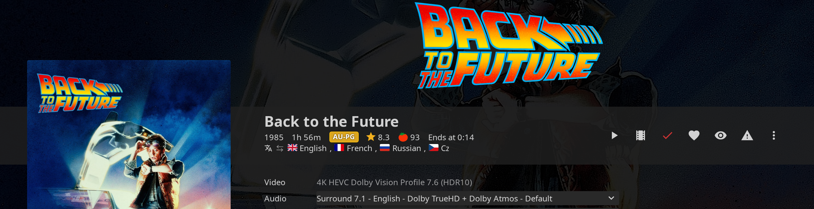

# Features Guide

Jellyfin Enhanced bundles dozens of features into one convenient plugin. This guide covers all available features and how to use them.

---

## Browsing & Detail Pages

Jellyfin Enhanced adds extra information to item detail pages — in the example below you can see the **watch-progress "Ends at" time**, the **TMDB (★) and Rotten Tomatoes (🍅) rating tags**, and the **audio-language country flags**, all on one line:

### Random Item Button

Adds a dice button to the Jellyfin header that opens a random title from your accessible libraries.

**Features:**

- A `casino` (dice) button in the header; click it to jump straight to a random item's detail page
- Can also be triggered with the ++r++ shortcut from anywhere outside the video player
- **Include movies** and **Include shows** toggles control what's in the random pool
- **Show unwatched only** restricts the pick to titles you haven't finished (unwatched movies, or series with unplayed episodes)

**Configuration:**

Open the Enhanced panel → **Settings** → **Random Button**. Administrators set the defaults under **Dashboard → Plugins → Jellyfin Enhanced → Display → Random Button**.

### Watch Progress

Shows your total watch progress for an item (and its children, e.g. a whole series) on its detail page.

**Features:**

- A circular progress ring plus a value, shown in the item's media-info row
- Works for movies, episodes, seasons, series, box sets, and playlists
- **Click the indicator** to cycle the value between three modes:
    - **Percentage** (e.g. `42%`) — the default
    - **Time Watched** (e.g. `1h 12m / 2h 5m`)
    - **Time Remaining** (e.g. `-53m / 2h 5m`)
- The **Time Format** can show durations as hours/minutes or as larger units (days/months/years)

**Configuration:**

Off by default. Enable via Enhanced panel → **Settings** → **UI** → **Show watch progress**, or set the server default (and default display mode / time format) under **Dashboard → Plugins → Jellyfin Enhanced → Display**.

### File Sizes

Displays the total file size of an item on its detail page (sums children for seasons, series, box sets, and playlists).

- Shown with a `save` icon in the media-info row
- Off by default — enable via Enhanced panel → **Settings** → **UI** → **Show file sizes**, or the **Display** tab in the admin config

### Audio Languages

Lists the available audio languages for a title on its detail page, shown as country flags with language names.

**Features:**

- Country-flag icons next to each language name
- Works for movies, episodes, seasons, and series (series/seasons read the first episode's audio tracks)
- Languages are de-duplicated, and the row becomes horizontally scrollable when there are more than three

**Configuration:**

On by default. Toggle via Enhanced panel → **Settings** → **UI** → **Show available audio languages**, or the admin **Display** tab.

### Remove from Continue Watching

Adds a **Remove from Continue Watching** option to a card's right-click / long-press context menu.

**Features:**

- Removes the item from the Continue Watching row **non-destructively** — your playback position is preserved
- The removed entry appears in the [Hidden Content](#hidden-content-system) management page (look for an "Add back to Continue Watching" action)
- Items reappear automatically when you resume playback
- Empty Continue Watching / Next Up rows are hidden so no stray title lingers

**Configuration:**

Off by default. Enable via Enhanced panel → **Settings** → **UI**, or the admin **Display** tab (**Enable "Remove from Continue Watching"**).

---

## Content Management

### Hidden Content System

Per-user content hiding: hide titles you don't want to see, with the hidden list stored server-side and granular filter controls for each browsing surface.

**Features:**

- Hide individual movies, series, episodes, seasons, and cast members
- Hidden state is stored server-side per user, so it survives browser and device changes
- A management page with search, grouping, and bulk operations
- Per-surface filter toggles
- A confirmation dialog with an optional "don't ask again" window

**Hide scopes:**

When you hide something you choose how broadly it applies:

- **Global** — hidden everywhere (the default)
- **Next Up** — hidden only from the Next Up row
- **Continue Watching** — hidden only from the Continue Watching row
- **Home sections** — hidden from both the Continue Watching *and* Next Up rows on the home screen, while still appearing elsewhere

Hiding a **series** cascades to its episodes and seasons (matched by parent series). Hiding an **episode** (or season) from a detail page offers a choice dialog: hide just that item, or hide the **entire show**.

**Surfaces that can be filtered:**

Each surface has its own toggle (defaults shown):

| Surface | Default |
| :--- | :---: |
| Library views | On |
| Discovery pages (Seerr) | On |
| Search results | Off |
| Calendar | On |
| Upcoming | On |
| Next Up | On |
| Continue Watching | On |
| Recommendations | On |
| Requests page | On |

**How to hide content:**

1. Open an item detail page (or use a hide button on a card, where enabled)
2. Click the hide button (`visibility_off` icon)
3. For an episode/season, choose whether to hide just it or the whole show
4. Confirm in the dialog

The confirmation dialog includes a **"don't ask again for 15 minutes"** checkbox; an administrator can also disable the confirmation entirely. (The episode-vs-show and surface-scoped dialogs always confirm, regardless of the suppression window.)

**Management page:**

The Hidden Content page lets you:

- Search hidden items by name
- Browse them grouped into **Movies**, **Series** (grouped per show, expandable, with per-show "unhide all"), and **Cast/Actors**
- Filter to show only items hidden from Next Up / Continue Watching
- Unhide individual items, a whole show, or everything at once

It is reached through a sidebar link (under the **Jellyfin Enhanced** menu section), or via the **Plugin Pages** or **Custom Tabs** companion plugins, depending on how an administrator configured it.

**Configuration:**

1. The feature is enabled by an administrator under **Dashboard → Plugins → Jellyfin Enhanced → Pages → Hidden Content**, which also sets the per-user defaults (hide-button placement, per-surface filters, confirmation) and the integration method (Plugin Pages / Custom Tabs / sidebar).
2. Individual users can adjust their own hide-button and filter toggles from the Hidden Content page.

!!! note
    Hidden items are never deleted from your library — they are only filtered out of views. Filtering happens in two places. Most core surfaces are filtered **server-side**, before results reach any client: the plugin filters the API responses for Continue Watching (resume items), library listings, Latest Media, Next Up, Upcoming Episodes, Suggestions/Recommendations, and Search hints. Surfaces that aren't covered by those endpoints (such as the Seerr discovery rows, the Calendar, and the Requests page) are filtered **client-side** as you navigate, by hiding the matching cards. Because the core filtering is server-side, hidden items stay hidden on every Jellyfin client, not just the web UI.

---

## Playback & Controls

### Advanced Keyboard Shortcuts

Comprehensive hotkeys for navigation, playback control, and more. Press ++shift+slash++ (i.e. ++question++) anywhere to open the Enhanced panel and view the full list.

!!! note
    Shortcuts are ignored while you are typing in a text field, and the global shortcuts below are suppressed on the video player page (the player keys take over there). The whole shortcut system can be turned off by an administrator with **Disable All Keyboard Shortcuts**.

**Default Global Shortcuts:**

| Key | Action |
| :---: | :--- |
| ++slash++ | Open Search |
| ++shift+h++ | Go to Home |
| ++d++ | Go to Dashboard |
| ++q++ | Quick Connect |
| ++r++ | Play Random Item (triggers the [Random Item button](#random-item-button)) |

**Default Player Shortcuts:**

| Key | Action |
| :---: | :--- |
| ++a++ | Cycle Aspect Ratio (Auto → Cover → Fill) |
| ++i++ | Show Playback Info (stats overlay; toggles open/closed) |
| ++s++ | Subtitle Menu (toggles open/closed) |
| ++c++ | Cycle Subtitle Tracks |
| ++v++ | Cycle Audio Tracks |
| ++plus++ | Increase Playback Speed |
| ++minus++ | Decrease Playback Speed |
| ++r++ | Reset Playback Speed (back to 1×) |
| ++b++ | Bookmark Current Time |
| ++p++ | Open Episode Preview *(requires the [InPlayerEpisodePreview](https://github.com/Namo2/InPlayerEpisodePreview/) plugin)* |
| ++o++ | Skip Intro/Outro |
| ++comma++ | Step Back One Frame |
| ++period++ | Step Forward One Frame |
| ++z++ | Jump to Last Position (before the most recent seek) |
| ++0++ – ++9++ | Jump to 0%–90% of the video's duration |

!!! note
    The number keys ++0++ through ++9++ jump to that multiple of 10% of the runtime (e.g. ++3++ jumps to 30%). They are fixed and do not appear in the customizable list.

**Customization:**

1. Press ++question++ to open the Enhanced panel
2. Go to the **Shortcuts** tab
3. Click on any key to set a custom shortcut
4. Changes save automatically, per user

A small dot next to a shortcut indicates that you have changed it from its default.

### Smart Bookmarks

Save timestamps and jump to specific moments with visual timeline markers.

**Features:**

- Create unlimited bookmarks during playback with ++b++ (or the `bookmark_add` button in the player OSD)
- Visual pin markers on the video timeline that you click to jump straight to that moment
- Add an optional label to each bookmark (e.g. "Epic scene")
- Bookmarks are matched to the current title by Jellyfin item ID first, then fall back to the same TMDB/TVDB ID — so they follow a movie or episode even if you re-add or replace the underlying file
- Stored server-side per user, so they survive browser and device changes

**Usage:**

1. While watching, press ++b++ at any moment
2. Add an optional label, then save
3. The bookmark appears as a pin marker on the timeline
4. Click any marker to jump to that timestamp

**Timeline marker colors:**

| Color | Meaning |
| :---: | :--- |
| Cyan | Exact match — the bookmark was created on this exact Jellyfin item |
| Orange | Provider match — the bookmark belongs to the same title (matched by TMDB/TVDB ID) but a different file/version, so the timestamp may be slightly off |

**Bookmark Library:**

A full Bookmark Library page lists every bookmark across your library, split into **Movies** and **Series** tabs and grouped by title. From there you can:

- Play, edit (time + label), or delete individual bookmarks
- **Find Duplicates** — detect the same title stored as multiple library entries (same TMDB/TVDB ID, different Jellyfin IDs) and merge their bookmarks onto a primary item
- **Cleanup** — remove orphaned bookmarks whose underlying item no longer exists in Jellyfin
- **Find Replacement** — re-point an orphaned bookmark to a matching item found by provider ID
- **Adjust Offset** — shift all synced bookmarks by a number of seconds to line them up with a different file version
- **Delete All** — clear every bookmark

The Bookmark Library is reached through a sidebar link (under the **Jellyfin Enhanced** menu section), or via the **Plugin Pages** or **Custom Tabs** companion plugins, depending on how an administrator has configured it.

!!! note
    There is no separate export/import file for bookmarks. Because they are stored server-side per user, they are already portable across your devices automatically.

### Custom Pause Screen

Beautiful overlay with media info that appears a few seconds after you pause a video.

**Displays:**

- Logo (falls back to the season/series logo when needed)
- Year, official rating, and runtime
- Plot/description
- A progress bar with elapsed / total time, watched percentage, and the projected "ends at" clock time
- Spinning disc artwork animation
- Blurred backdrop image

**Idle delay:**

The pause screen does not appear the instant you pause — it waits until you have been idle for a configurable number of seconds (default **5**), so quick pauses don't trigger it. The delay timer resets on mouse movement (beyond a small threshold), clicks, key presses, scrolling, and touch input. Once you dismiss the pause screen with its close button, it will not re-appear until the next pause.

To change the delay, open the Enhanced panel → **Settings** → **Playback**, and adjust the value next to **Enable Custom Pause Screen**.

**Accessibility:**

- The overlay is a focus-trapped dialog (`role="dialog"`, `aria-modal`)
- Press ++space++ or ++enter++ to resume playback while it is showing
- ++tab++ focus is kept inside the overlay
- The spinning disc animation is disabled automatically when the OS requests reduced motion
- On narrow/portrait mobile layouts the disc is hidden and the layout re-centers

!!! tip

    [Custom CSS available](../advanced/css-customization.md)

### Smart Playback

Intelligent playback features for a better viewing experience.

**Tab-switch behavior:**

- **Auto-pause on tab switch** — pause playback automatically when you switch to another browser tab *(on by default)*
- **Auto-resume on tab switch** — resume playback when you switch back to the player tab *(off by default; only resumes video that auto-pause had paused)*
- **Auto Picture-in-Picture on tab switch** — enter the browser's PiP mode when you leave the tab, and exit it when you return *(off by default; requires browser PiP support)*

**Auto-skip:**

- **Auto-skip intro** and **Auto-skip outro** — automatically click the Skip button as soon as it appears *(both off by default)*

!!! note
    Auto-skip relies on the Skip button that Jellyfin's intro-detection / [Intro Skipper](https://github.com/intro-skipper/intro-skipper) provides. With no skip segments there is nothing to skip. You can also skip manually at any time with ++o++.

**Playback speed:**

- Increase/decrease speed with ++plus++ / ++minus++, or reset to 1× with ++r++. Speed steps through this fixed list:

    `0.25×` · `0.5×` · `0.75×` · `1×` · `1.25×` · `1.5×` · `1.75×` · `2×`

- **Long-press for 2× (beta)** — when enabled, press and hold anywhere on the video (mouse or touch) to temporarily boost to 2× speed; release to return to your previous speed. A small on-screen overlay shows the active speed, and a brief haptic buzz fires on supported devices. Dragging/scrubbing cancels the boost. *(Off by default.)*

**Frame step & jump-back:**

- ++comma++ / ++period++ step exactly one frame backward/forward, pausing the video and showing a frame/FPS overlay. The frame rate is read from the media; if it can't be determined, a 24 fps fallback is used (with a one-time notice).
- ++z++ jumps back to the position you were at just before your most recent seek — handy for undoing an accidental skip.

**Configuration:**

Enable or disable these features in the Enhanced panel → **Settings** tab (**Playback** and **Auto Skip** sections). Administrators can also set the server-wide defaults under **Dashboard → Plugins → Jellyfin Enhanced → Playback**.

### Customizable Subtitles

Fine-tune subtitle appearance with style, size, font, and position presets.

**Style presets:**

| Preset | Look |
| :--- | :--- |
| **Clean White** | White text with a soft black glow, no background *(default)* |
| **Classic Black Box** | White text on a solid black box |
| **Netflix Style** | White text on a semi-transparent black box |
| **Cinema Yellow** | Yellow text on a semi-transparent black box |
| **Soft Gray** | White text on a semi-transparent gray box |
| **High Contrast** | Black text on a solid white box |

**Font size presets:**

Tiny · Small · **Normal** *(default)* · Large · Extra Large · Gigantic

**Font family presets:**

**Default** *(inherit)* · Noto Sans · Sans Serif · Typewriter · Roboto

**Position:**

A drag-and-drop preview grid lets you place the subtitles anywhere over the video; the default anchor is centered horizontally and near the bottom (50% / 85%). A reset button restores the default position.

**Disable custom styles:**

A **Disable Custom Subtitle Styles** toggle turns off all of Jellyfin Enhanced's subtitle styling and positioning, leaving Jellyfin's native subtitle rendering untouched. Useful when a subtitle track carries its own styling you want to preserve.

**Usage:**

1. Open the Enhanced panel → **Settings** → **Subtitles**
2. Pick a style, size, and font preset, and drag the position preview
3. Changes apply immediately and are saved per user

!!! note
    For the custom position to take effect, set Jellyfin's subtitle appearance to **Custom** in its own subtitle settings.

Administrators can set the server-wide default style, size, font, and the global "disable custom styles" behavior under **Dashboard → Plugins → Jellyfin Enhanced → Playback → Subtitles**.

---

## Discovery & Integration

### Seerr Search Integration

Search, request, and discover media directly from Jellyfin's search interface.

**Features:**

- Search Seerr from Jellyfin search bar
- Request movies and TV shows
- View request status (pending, approved, available)
- Auto-add requested media to watchlist
- Sync Seerr watchlist to Jellyfin

**Setup:**

1. Open plugin settings → **Seerr** tab
2. Check "Show Seerr Results in Search"
3. Enter Seerr URL(s) (one per line)
4. Enter Seerr API Key (from Seerr Settings → General)
5. Click "Test Connection"
6. Enable optional features:
   - Add Requested Media to Watchlist
   - Sync Seerr Watchlist to Jellyfin
7. Click **Save**

**Requirements:**

- Seerr instance with API access
- "Enable Jellyfin Sign-In" enabled in Seerr
- Jellyfin users imported into Seerr

**Icon States:**

| **Icon** | **State** | **Description** |
| :---: | :--- | :--- |
| | **Active** | Seerr is successfully connected, and the current Jellyfin user is correctly linked to a Seerr user.   Results from Seerr will load along with Jellyfin and requests can be made. |
|  | **User Not Found** | Seerr is successfully connected, but the current Jellyfin user is not linked to a Seerr account.  Ensure the user has been imported into Seerr from Jellyfin. Results will not load. |
|  | **Offline** | The plugin could not connect to any of the configured Seerr URLs.   Check your plugin settings and ensure Seerr is running and accessible. Results will not load. |

### Seerr Item Details

View recommendations and similar items on detail pages.

**Features:**

- Recommended items section
- Similar items section
- Request directly from recommendations
- Exclude items already in library
- Real-time request status indicators
- Support for 4K requests
- TV season selection

**Setup:**

1. Configure Seerr integration (see above)
2. Check "Show Seerr Recommendations and Similar items"
3. Optional: Enable "Exclude already in library items"
4. Click **Save**

**Discovery Pages:**

- Genre-based discovery
- Network-based discovery
- Person-based discovery (actors, directors)
- Tag-based discovery
- All with TV/Movies/All filtering

### .arr Links Integration

Quick access to Sonarr, Radarr, and Bazarr (admin only).

**Features:**

- Direct links to item pages in Sonarr/Radarr
- Bazarr subtitle management links
- Display *arr tags as clickable links
- Filter and customize tag display

### Streaming Provider Lookup

See where else your media is available to stream.

**Features:**

- Multi-region support
- Buy, rent, and stream options
- Provider logos and links
- Powered by TMDB data

**Usage:**

1. Enable in Enhanced panel → Settings
2. Select your region
3. View providers on item detail pages

### User Reviews

Jellyfin users can write their own reviews for movies, series, seasons, and episodes. Reviews are stored server-side and visible to all users.

**Features:**

- Write a review with a star rating (1-5) and optional text, or just a rating with no text
- Reviews appear in a dedicated "Reviews" section on item detail pages, listed before TMDB reviews
- Edit or delete your own review at any time
- Average user rating chip displayed next to TMDB/RT ratings in the item media info bar
- Average user rating also shown as a poster tag (`person_heart` icon) on library cards when rating tags are enabled
- Admin moderation — admins can delete any user's review

**How to write a review:**

1. Open any movie, series, season, or episode detail page
2. Scroll to the **Reviews** section
3. Click **Add Review**
4. Select a star rating (optional) and write your review text (optional — a rating alone is valid)
5. Click the save icon

**Setup (admin):**

1. Go to **Dashboard** → **Plugins** → **Jellyfin Enhanced**
2. Navigate to the **Elsewhere** tab
3. Enable **"Enable User Written Reviews"**
4. Optionally enable **"Show average user rating on poster cards"** to display the average rating as a poster tag (requires the user's Rating Tags to be enabled)
5. Optionally disable **"Show \"—\" on posters for unrated items"** to hide the `—` placeholder on posters when no ratings exist yet
6. Click **Save**

!!! note
    The poster tag requires the user to also have **Rating Tags** enabled in the Enhanced panel (Settings tab).

**Admin moderation:**

Admins see a delete button on all reviews, not just their own. A confirmation dialog is shown before deletion. The action is logged and the section refreshes automatically.

---

### TMDB Reviews

Display user reviews from TMDB on item pages.

**Features:**

- Full review text
- Author information
- Rating scores
- Review dates
- Expandable/collapsible reviews

**Setup:**
Enable **"Show TMDB Reviews"** in **Dashboard** → **Plugins** → **Jellyfin Enhanced** → **Elsewhere** tab.

See [Elsewhere Features](../elsewhere/elsewhere-features.md#tmdb-reviews) for full details.

---

## Visual Enhancements

### Poster Tags Overview

The Quality, Genre, Language, and Rating tags below are all drawn by a single, unified tag pipeline that scans poster cards once, fetches their data in one batched request, and renders each enabled tag type into its assigned corner.

**How it's served:**

- With **Server-Side Tag Cache** enabled (the recommended default), the server pre-computes tag data and serves it in one request, so tags appear instantly with no per-page API calls. A scheduled server task keeps this cache built and up to date.
- With it disabled, the legacy per-page batch mode is used instead, optionally backed by a browser-localStorage fallback cache.
- Tag data is cached for a configurable number of days (**Tags Cache Duration**, default **30 days**).

**Per-corner positions** — each tag type renders in one corner, configurable per user and as a server default:

| Tag type | Default corner |
| :--- | :--- |
| Quality | Top-left |
| Genre | Top-right |
| Language | Bottom-left |
| Rating | Bottom-right |

A **Hide Tags on Hover** option fades the tag layer out while you hover a card, and **Disable Tags on Search Page** keeps search results clean (recommended for compatibility with the Gelato plugin). Each tag type has its own enable toggle in the Enhanced panel (**Settings → UI**) and in the admin **Display → Media Tags** section.

### Quality Tags

Display quality information (4K, HDR, Atmos, …) directly on poster cards. Detected from the media's streams; for series and seasons the first episode's streams are used.

**Tag categories (each can be toggled and reordered):**

- **Resolution:** `8K`, `4K`, `1440p`, `1080p`, `720p`, `480p`, `LOW-RES`, `SD` (only the single best resolution is shown)
- **Source / media stubs:** `BluRay`, `HD DVD`, `DVD`, `VHS`, `HDTV`, `Physical`
- **Dynamic range (HDR):** `Dolby Vision`, `HDR10+`, `HDR10`, `HDR`
- **Special format:** `IMAX`, `3D`
- **Video codec:** `AV1`, `HEVC`, `H265`, `VP9`, `H264`, and other formats (VP8, XVID, DIVX, WMV, MPEG2, MPEG4, MJPEG, THEORA)
- **Audio:** `ATMOS`, `DTS-X`, `TRUEHD`, `DTS`, `Dolby Digital+`, with a channel layout (`7.1` / `5.1`) appended

Each category has a colored badge, and you can choose which categories appear and the order they stack within the chosen corner (admins: **Display → Media Tags → Configure tag categories**; users: **Settings → UI → Quality Tags categories**).

### Genre Tags

Identify genres with themed icons on poster cards.

**Features:**

- A Material Symbols icon for each genre (with a sensible default for unrecognized genres)
- Circular badges that reveal the genre name beside them on hover
- Up to 3 genres shown per item
- For seasons/series with no genres of their own, the parent series or first episode genres are used
- Customizable position (default top-right)

### Language Tags

Display available audio languages as country flags on poster cards.

**Features:**

- Country-flag icons derived from each audio track's language
- Languages are de-duplicated by country (e.g. multiple flavors of one country collapse to a single flag, with the others listed in its tooltip)
- Up to 3 flags shown per card
- Series/seasons read the first episode's audio tracks
- Positioned bottom-left by default

### Rating Tags

Show TMDB and Rotten Tomatoes ratings on poster cards (and optionally in the player).

**Features:**

- **TMDB** community rating shown to one decimal with a star icon (a `0.0` is shown as `—`, since it means "no data")
- **Rotten Tomatoes** critic score shown as a percentage with a fresh or rotten tomato icon (fresh at 60% and above)
- For episodes and seasons with no rating of their own, the parent series rating is used
- Positioned bottom-right by default
- When [User Reviews](#user-reviews) and "Show User Rating on Posters" are enabled, the average user rating is appended as an extra chip (see below)

#### In-Player Rating (OSD)

When **Show Rating in Video Player** is enabled (on by default), the same TMDB and Rotten Tomatoes chips appear in the player's bottom bar, just before the "Ends at" time. Episodes/seasons fall back to the parent series rating here too.

### People Tags

Display age and birthplace information for cast members — shown on the cast/guest-cast cards of an item's detail page.

**Displays:**

- **Current age** chip (or **age at death** for deceased people)
- **Age at the item's release** chip
- **Birthplace** banner along the bottom of the card, with a country flag
- **Deceased indicator** — the portrait is dimmed to grayscale and marked with a cross (✝)

Data is cached for performance (default 30 days, set via the admin config).

---

## More visual & server features

Jellyfin Enhanced also bundles a number of visual tweaks and admin/server features. To keep this page focused on the core viewing experience, they are documented on the **[Other Features](../other/other-features.md)** page:

- **[Active Streams widget](../other/other-features.md#active-streams-header-widget)** — a live session counter and panel with direct-play/transcode and codec badges, plus an admin broadcast tool
- **[Colored dashboard activity icons](../other/other-features.md#colored-dashboard-icons)**
- **[Colored rating (certification) backgrounds](../other/other-features.md#colored-ratings-backgrounds)**
- **[Profile picture on login](../other/other-features.md#profile-picture-on-login)**
- **[Custom plugin menu icons](../other/other-features.md#custom-plugin-menu-icons)** and **[metadata icons](../other/other-features.md#metadata-icons)**
- **[Theme selector (Jellyfish)](../other/other-features.md#theme-selector-jellyfish)**
- **[Custom branding](../other/other-features.md#custom-branding)** — your own logo, banners, and favicon
- **[Splash screen](../other/other-features.md#splash-screen)** and **[Maintenance Mode](../other/other-features.md#maintenance-mode)**
- **[Internationalization & translations](../other/other-features.md#internationalization)**

## Customization

Nearly every element Jellyfin Enhanced adds can be restyled with your own CSS. See the **[CSS Customization Guide](../advanced/css-customization.md)** for ready-made snippets covering the pause screen, all poster tags, the in-player rating, *arr tag links, and the Enhanced panel.
