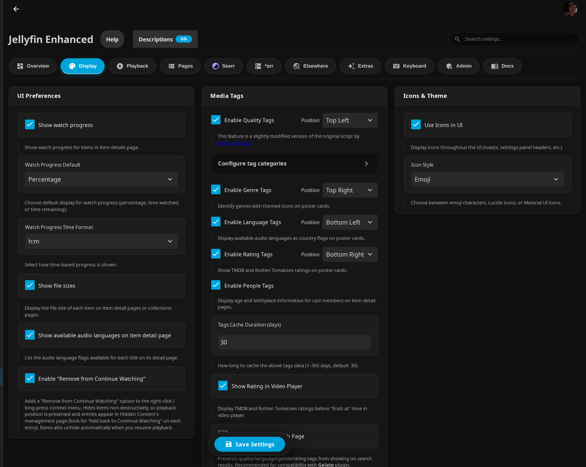
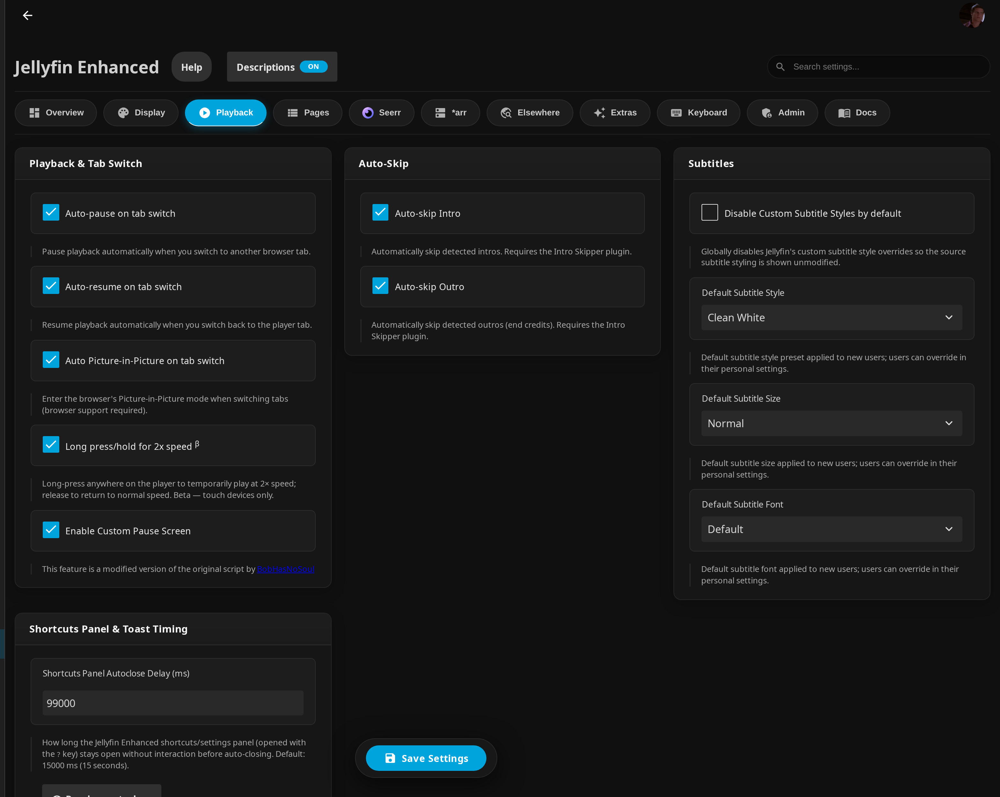
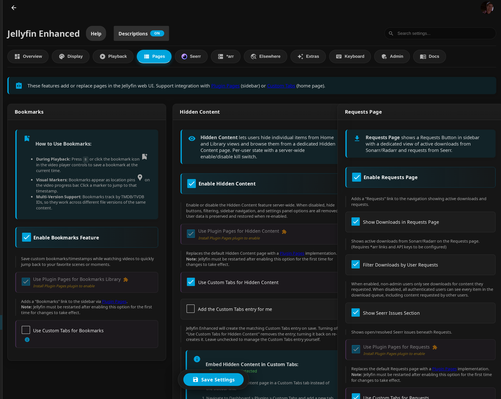
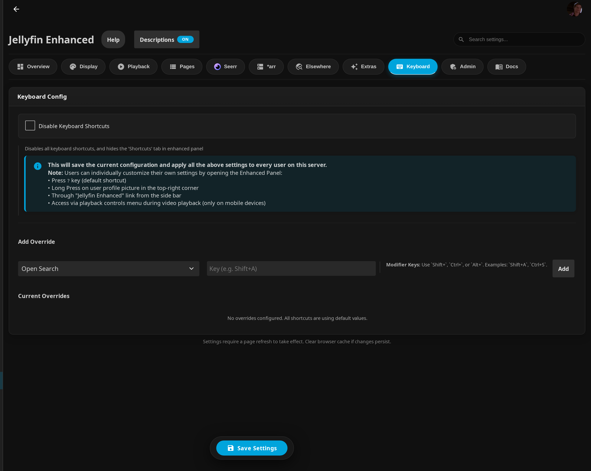

# Enhanced Settings

Jellyfin Enhanced has **two** places where its core behaviour is configured:

1. **Per-user settings** — the **Enhanced Panel → Settings** tab, available to every
   user. Stored per user on the server (in `settings.json` / `shortcuts.json`).
2. **Admin server defaults** — **Dashboard → Plugins → Jellyfin Enhanced**, on the
   **Display**, **Playback**, and **Pages** tabs. These define the defaults that
   apply to new users and act as feature kill-switches.

!!! info "How admin defaults and per-user settings interact"

    Most toggles exist in **both** places. The admin value is the *server default*:
    it is applied to a user the first time they load Enhanced, and to features the
    user has never explicitly changed. Once a user changes a setting in their
    Enhanced Panel, their choice becomes "sticky" and overrides the admin default for
    them. A few settings are **admin-only** (e.g. cache behaviour, default language,
    timing) and a few are **per-user-only** (e.g. custom subtitle colours, subtitle
    position). The **Scope** column in each table below states which is which.

---

## The Enhanced Panel

| Shortcuts | Settings |
|-----------|----------|
|  |  |

**Open the panel:**

- Press the ++"?"++ keyboard shortcut
- Click **Jellyfin Enhanced** in the sidebar
- Long-press your user profile picture in the top-right corner
- Access via the playback controls menu during video playback *(mobile only)*

**Tabs:**

- **Shortcuts** — view and rebind keyboard shortcuts (hidden when the admin has
  disabled all shortcuts — see [Keyboard shortcuts](#keyboard-shortcuts)).
- **Settings** — collapsible sections of toggles: *Playback*, *Auto-Skip*,
  *Subtitles*, *Random Button*, *Display & UI* (includes Media Tags), *Hidden
  Content* (only when enabled server-wide), and *Language*.

**Persistence:** per-user settings are saved to the server (not browser
localStorage), so they follow the user across devices and browsers. Changes apply
immediately — no restart needed (except where a setting note says otherwise).

---

## Display tab (admin)

Found at **Dashboard → Plugins → Jellyfin Enhanced → Display**.

### UI Preferences

| Setting | What it does | Default | Scope |
|---------|--------------|---------|-------|
| Show watch progress | Show watch progress for items on the item details page. | Off | Admin default / Per-user |
| Watch Progress Default | Default display for watch progress: **Percentage**, **Time Watched**, or **Time Remaining**. | `Percentage` | Admin default / Per-user |
| Watch Progress Time Format | How time-based progress is shown: **h:m** (`hours`) or **y:mo:d:h:m** (`full`). | `h:m` (`hours`) | Admin default / Per-user |
| Show file sizes | Display the file size of each item on item detail / collection pages. | Off | Admin default / Per-user |
| Show available audio languages on item detail page | List audio-language flags for each title on its detail page. | On | Admin default / Per-user |
| Enable "Remove from Continue Watching" | Adds a non-destructive "Remove from Continue Watching" option to the right-click / long-press menu. Items move to the Hidden Content management page and unhide on resume. | Off | Admin default / Per-user |

### Media Tags

Overlay badges on poster cards / detail pages. Each tag type has its own
enable toggle and a corner **Position** selector (Top Left / Top Right / Bottom
Left / Bottom Right).

| Setting | What it does | Default | Scope |
|---------|--------------|---------|-------|
| Enable Quality Tags | Show quality badges (resolution, source, HDR, etc.) on posters. | Off | Admin default / Per-user |
| Quality Tags — Position | Corner the quality tags stack in. | `Top Left` | Admin default / Per-user |
| Enable Genre Tags | Identify genres with themed icons on poster cards. | Off | Admin default / Per-user |
| Genre Tags — Position | Corner for genre tags. | `Top Right` | Admin default / Per-user |
| Enable Language Tags | Show available audio languages as country flags on poster cards. | Off | Admin default / Per-user |
| Language Tags — Position | Corner for language tags. | `Bottom Left` | Admin default / Per-user |
| Enable Rating Tags | Show TMDB and Rotten Tomatoes ratings on poster cards. | Off | Admin default / Per-user |
| Rating Tags — Position | Corner for rating tags. | `Bottom Right` | Admin default / Per-user |
| Enable People Tags | Show age and birthplace for cast members on item detail pages. (No position selector.) | Off | Admin default / Per-user |
| Tags Cache Duration (days) | How long tag data is cached (1–365 days). | `30` | Admin only |
| Show Rating in Video Player | Show TMDB / Rotten Tomatoes ratings before the "Ends at" time in the player. | On | Admin default / Per-user |
| Disable Tags on Search Page | Stop quality/language/genre/rating tags from rendering on search results (recommended with the **Gelato** plugin). | Off | Admin only |
| Hide Tags on Hover | Tag overlays fade out when hovering a card. Users can override this in their own settings. | Off | Admin default / Per-user |
| Server-Side Tag Cache | Pre-compute tag data on the server and serve it in one request (instant load). Disable to use legacy per-page batch mode (not recommended). | On | Admin only |
| Persist Tag Fallback Cache in Browser Storage | Available only when Server-Side Tag Cache is off; stores fallback tag cache in browser localStorage. | Off | Admin only |

The **Configure tag categories** sub-panel (under Quality Tags) controls which
quality categories appear and the order they stack within the chosen corner.
Reorder with the up/down arrows.

| Quality category | Example values | Shown by default | Default order | Scope |
|------------------|----------------|------------------|---------------|-------|
| Show resolution | 4K, 1080p, … | On | 1 | Admin default / Per-user |
| Show source | BluRay, DVD, HDTV, VHS, … | On | 2 | Admin default / Per-user |
| Show HDR | HDR10+, Dolby Vision | On | 3 | Admin default / Per-user |
| Show special format | IMAX, 3D | On | 4 | Admin default / Per-user |
| Show video format | HEVC, H264, AV1, … | On | 5 | Admin default / Per-user |
| Show sound | Atmos, DTS, 5.1, 7.1, … | On | 6 | Admin default / Per-user |

There is also a **Clear All Client Caches** button that forces clients to clear
their tag caches on next load.

!!! tip

    [Custom CSS available](../advanced/css-customization.md#tags)

### Icons & Theme

| Setting | What it does | Default | Scope |
|---------|--------------|---------|-------|
| Use Icons in UI | Display icons throughout the UI (toasts, settings panel headers, etc.). | On | Admin only |
| Icon Style | **Emoji**, **Lucide Icons**, or **Material UI Icons**. | `Emoji` | Admin only |

### Random Button

| Setting | What it does | Default | Scope |
|---------|--------------|---------|-------|
| Enable Random Button | Adds a "Play Random" button to the Jellyfin header that opens a random item from the user's accessible libraries. | On | Admin default / Per-user |
| Show unwatched only | Random picker only chooses items the user has not watched. | Off | Admin default / Per-user |
| Include movies | Include movies in the random pool. | On | Admin default / Per-user |
| Include shows | Include TV shows in the random pool. | On | Admin default / Per-user |

### Default Language

| Setting | What it does | Default | Scope |
|---------|--------------|---------|-------|
| Default UI Language | Default Enhanced UI language for all users; users can override it in their own settings. | `System Default` (empty) | Admin only (default for per-user *Language*) |

---

## Playback tab (admin)

Found at **Dashboard → Plugins → Jellyfin Enhanced → Playback**.

### Playback & Tab Switch

| Setting | What it does | Default | Scope |
|---------|--------------|---------|-------|
| Auto-pause on tab switch | Pause playback automatically when you switch to another browser tab. | **On** | Admin default / Per-user |
| Auto-resume on tab switch | Resume playback automatically when you switch back to the player tab. | **Off** | Admin default / Per-user |
| Auto Picture-in-Picture on tab switch | Enter the browser's PiP mode when switching tabs (browser support required). | Off | Admin default / Per-user |
| Long press/hold for 2x speed *(β)* | Long-press the player to temporarily play at 2× speed; release to return to normal. Beta — touch devices only. | Off | Admin default / Per-user |
| Enable Custom Pause Screen | Show the custom pause overlay when playback is paused. | On | Admin default / Per-user |

!!! note "Pause Screen Delay"

    The per-user *Custom Pause Screen* toggle in the Enhanced Panel also exposes a
    **delay** input (`pauseScreenDelaySeconds`, 1–60 s, default **5**) controlling how
    long the screen waits before appearing. This is per-user; there is no admin field
    for it on the Playback tab.

### Auto-Skip

| Setting | What it does | Default | Scope |
|---------|--------------|---------|-------|
| Auto-skip Intro | Automatically skip detected intros. Requires the **Intro Skipper** plugin. | Off | Admin default / Per-user |
| Auto-skip Outro | Automatically skip detected outros (end credits). Requires the **Intro Skipper** plugin. | Off | Admin default / Per-user |

### Subtitles

| Setting | What it does | Default | Scope |
|---------|--------------|---------|-------|
| Disable Custom Subtitle Styles by default | Globally disable Jellyfin's custom subtitle style overrides so the source styling shows unmodified. | Off | Admin default / Per-user |
| Default Subtitle Style | Style preset applied to new users (overridable per user). | `Clean White` (index `0`) | Admin only (default for per-user) |
| Default Subtitle Size | Size preset applied to new users (overridable per user). | `Normal` (index `2`) | Admin only (default for per-user) |
| Default Subtitle Font | Font preset applied to new users (overridable per user). | `Default` (index `0`) | Admin only (default for per-user) |

**Subtitle style presets** (index → name): `0` Clean White · `1` Classic Black
Box · `2` Netflix Style · `3` Cinema Yellow · `4` Soft Gray · `5` High Contrast.

**Subtitle size presets** (index → name): `0` Tiny · `1` Small · `2` Normal ·
`3` Large · `4` Extra Large · `5` Gigantic.

**Subtitle font presets** (index → name): `0` Default · `1` Noto Sans ·
`2` Sans Serif · `3` Typewriter · `4` Roboto.

### Shortcuts Panel & Toast Timing

| Setting | What it does | Default | Scope |
|---------|--------------|---------|-------|
| Shortcuts Panel Autoclose Delay (ms) | How long the Enhanced shortcuts/settings panel (opened with ++"?"++) stays open without interaction before auto-closing. | `15000` (15 s) | Admin only |
| Toast Notification Duration (ms) | How long Enhanced pop-up toasts (e.g. "Bookmark saved") stay on-screen before fading. | `1500` | Admin only |

!!! warning "Toast default discrepancy"

    The Toast field's help text says "Default: 3000 ms", but the actual code default
    (`PluginConfiguration.ToastDuration` and the client `TOAST_DURATION` fallback) is
    **1500 ms**. The value shown above is the real default.

Both timing fields have a **Preview** button to test the chosen value.

---

## Pages tab (admin)

Found at **Dashboard → Plugins → Jellyfin Enhanced → Pages**. These add or replace
pages in the Jellyfin web UI and integrate with the optional
[Plugin Pages](https://github.com/IAmParadox27/jellyfin-plugin-pages) (sidebar) and
[Custom Tabs](https://github.com/IAmParadox27/jellyfin-plugin-custom-tabs) (home
page) plugins.

!!! note

    Toggles named **"Use Plugin Pages …"** require a Jellyfin **restart** the first
    time they are enabled. The **"Add the Custom Tabs entry for me"** sub-toggle only
    appears when the Custom Tabs plugin is detected and its main "Use Custom Tabs"
    toggle is on; when checked, Enhanced creates/removes the matching Custom Tabs
    entry automatically on save.

### Bookmarks

| Setting | What it does | Default | Scope |
|---------|--------------|---------|-------|
| Enable Bookmarks Feature | Save custom timestamps while watching to jump back to favourite moments. Set with ++B++ or the bookmark icon in the player; markers appear as pins on the progress bar. Tracked by TMDB/TVDB ID, so they survive across file versions. | **On** | Admin only |
| Use Plugin Pages for Bookmarks Library | Add a "Bookmarks" link to the sidebar via Plugin Pages. *(Restart required first time.)* | Off | Admin only |
| Use Custom Tabs for Bookmarks | Show the Bookmarks library in a Custom Tabs tab instead of the sidebar link. | Off | Admin only |
| Add the Custom Tabs entry for me | Let Enhanced create/remove the matching Custom Tabs entry on save. | Off | Admin only |

### Hidden Content

A server-wide feature with a per-user state. The kill-switch and per-user
*defaults* are admin-controlled; the live per-user toggles are also exposed in the
Enhanced Panel (Hidden Content section) when the feature is enabled server-wide.

| Setting | What it does | Default | Scope |
|---------|--------------|---------|-------|
| Enable Hidden Content | Server-wide kill switch. When off, all hide buttons, filtering, navigation, and panel options are removed (user data is preserved and restored when re-enabled). | Off | Admin only |
| Use Plugin Pages for Hidden Content | Replace the default Hidden Content page with a Plugin Pages implementation. *(Restart required first time.)* | Off | Admin only |
| Use Custom Tabs for Hidden Content | Show the Hidden Content page in a Custom Tabs tab. | Off | Admin only |
| Add the Custom Tabs entry for me | Auto-manage the Custom Tabs entry on save. | Off | Admin only |

The **Default User Settings** sub-panel sets the defaults applied to new users and,
via the **Apply defaults to all users** button at the top of the page, optionally to
everyone. Existing users keep their current settings unless that button is clicked.

| Default-user setting | What it does | Default | Scope |
|----------------------|--------------|---------|-------|
| Hidden Content enabled by default | New users start with the feature active. | On | Admin default / Per-user |
| Show "Hide" buttons by default | Hide buttons appear across the app. | On | Admin default / Per-user |
| Show confirmation dialog before hiding | Ask "are you sure?" before hiding. | On | Admin default / Per-user |
| Show "Hide" button on Seerr search results | Add a Hide button to Seerr search / discover results. | On | Admin default / Per-user |
| Show "Hide" button on item details pages | Add a Hide button to the action-button row on detail pages. | On | Admin default / Per-user |
| Show "Hide" button on library / home cards | Add a small eye icon to every poster on home/library. | Off | Admin default / Per-user |
| Show "Hide" button on cast / actor cards | Hide an actor to hide everything they appear in. | Off | Admin default / Per-user |
| Filter Library & details pages | Hide hidden items while browsing libraries and in detail-page suggestion rows. | On | Admin default / Per-user |
| Filter Search results | Hide hidden items in search results. | Off | Admin default / Per-user |
| Filter Continue Watching | Hide hidden items in the Continue Watching row (required for "Remove from Continue Watching" to work). | On | Admin default / Per-user |
| Filter Next Up | Hide hidden series in the Next Up row. | On | Admin default / Per-user |
| Filter Upcoming episodes | Hide hidden series on the Upcoming Episodes page. | On | Admin default / Per-user |
| Filter Suggestions / recommendations | Hide hidden items in "Because you watched…" / "Suggested for you" rows. | On | Admin default / Per-user |
| Filter Discovery | Hide hidden items on the Discovery page. | On | Admin default / Per-user |
| Filter Calendar | Hide hidden series on the Calendar page. | On | Admin default / Per-user |
| Filter Requests page | Hide hidden items on the combined Requests page. | On | Admin default / Per-user |
| Allow hiding collections, libraries, and playlists *(experimental)* | Lets users hide whole collections/libraries/playlists. **Not recommended — will break things.** | Off | Admin default / Per-user |

### Requests Page

Adds a Requests link/page showing active Sonarr/Radarr downloads and Seerr
requests. *(Requires *arr URLs/API keys and/or Seerr to be configured.)*

| Setting | What it does | Default | Scope |
|---------|--------------|---------|-------|
| Enable Requests Page | Add a "Requests" link showing active downloads and requests. | Off | Admin only |
| Show Downloads in Requests Page | Show active Sonarr/Radarr downloads (requires *arr links + API keys). | On | Admin only |
| Filter Downloads by User Requests | Non-admins only see downloads for content they requested; otherwise everyone sees the whole queue. | On | Admin only |
| Show Seerr Issues Section | Show open/resolved Seerr issues beneath requests. | Off | Admin only |
| Use Plugin Pages for Requests | Replace the default Requests page with Plugin Pages. *(Restart required first time.)* | Off | Admin only |
| Use Custom Tabs for Requests | Show Requests in a Custom Tabs tab. | Off | Admin only |
| Add the Custom Tabs entry for me | Auto-manage the Custom Tabs entry on save. | Off | Admin only |
| Enable Auto-Refresh | Periodically refresh the page so download progress updates without reload. | On | Admin only |
| Poll Interval (seconds) | How often to auto-refresh (min 30, max 300; applies only when auto-refresh is on). | `30` | Admin only |

### Calendar Page

Adds a Calendar link/page showing upcoming Sonarr/Radarr releases. *(Requires
Sonarr and/or Radarr URLs + API keys.)*

| Setting | What it does | Default | Scope |
|---------|--------------|---------|-------|
| Enable Calendar Page | Add a "Calendar" link showing upcoming Sonarr/Radarr releases. | Off | Admin only |
| Use Plugin Pages | Replace the default Calendar page with Plugin Pages. *(Restart required first time.)* | Off | Admin only |
| Use Custom Tabs | Show the Calendar in a Custom Tabs tab. | Off | Admin only |
| Add the Custom Tabs entry for me | Auto-manage the Custom Tabs entry on save. | Off | Admin only |
| First Day of Week | Which day is the first column of the calendar grid. | `Monday` | Admin only |
| Time Format | Release times in 12-hour (`5pm/5:30pm`) or 24-hour (`17:00/17:30`) format. | `5pm/5:30pm` | Admin only |
| Highlight Favorites/Watchlist | Golden border on entries that are in your Jellyfin favorites. | Off | Admin only |
| Highlight Watched Series | Border on entries for series you have watched episodes from. | Off | Admin only |
| Filter by Library Access | Only show items from libraries the user can access (upcoming items filtered by their Sonarr/Radarr root folder). | On | Admin only |
| Show Requested Only (Default) | Calendar loads showing only requested items; users can still change filters. | Off | Admin only |
| Force Only Requested Items | Always show only requested items and hide the Requests filter. | Off | Admin only |

---

## Per-user settings (Enhanced Panel → Settings)

These mirror many of the admin defaults above but are stored **per user**. Below are
the per-user-only options that have no direct admin equivalent. (For the toggles
shared with the admin tabs — playback, auto-skip, random button, media tags, etc. —
see the corresponding admin tables; the per-user value overrides the admin default
once changed.)

### Subtitles (per-user only)

| Setting | What it does | Default | Scope |
|---------|--------------|---------|-------|
| Subtitle Style preset | Pick one of the six style presets (see above). | Style `0` (Clean White) | Per-user (seeded from admin *Default Subtitle Style*) |
| Subtitle Size preset | Pick one of the six size presets. | Size `2` (Normal) | Per-user (seeded from admin default) |
| Subtitle Font preset | Pick one of the five font presets. | Font `0` (Default) | Per-user (seeded from admin default) |
| Custom subtitle Text colour + alpha | Override the preset text colour with a custom colour and opacity. | `#FFFFFFFF` (white, opaque) | Per-user only |
| Custom subtitle Background colour + alpha | Override the preset background colour and opacity. | `#00000000` (transparent) | Per-user only |
| Subtitle Position (drag pad) | Drag a pad to set on-screen position. Requires Jellyfin's subtitle style set to **Custom**. | Horizontal `50`, Vertical `85` | Per-user only |

### Language (per-user)

| Setting | What it does | Default | Scope |
|---------|--------------|---------|-------|
| Display Language | The user's Enhanced UI language. | Admin *Default UI Language* (System Default) | Per-user |

### Reviews (per-user)

| Setting | What it does | Default | Scope |
|---------|--------------|---------|-------|
| Reviews expanded by default | Whether the reviews section starts expanded on detail pages. | Off | Admin default / Per-user |

---

## Keyboard shortcuts

The **Shortcuts** tab of the Enhanced Panel lists every shortcut grouped into
**Global** and **Player** categories.

### Rebinding a shortcut (per-user)

1. Open the Enhanced Panel (++"?"++) and go to the **Shortcuts** tab.
2. Click the key badge next to a shortcut — it shows **"Listening…"**.
3. Press the new key (optionally with ++Shift++, ++Ctrl++, ++Alt++, or ++Meta++).
   A bare modifier alone is not accepted.
4. If the combo is already used by another shortcut it is **rejected** (the badge
   flashes red and shakes); pick a different key.
5. A dot (•) **modified** indicator appears next to rebound shortcuts.
6. Press ++Backspace++ while listening to **reset that shortcut to its default**.

Rebindings are saved per user to `shortcuts.json`. Admins can also add server-wide
overrides on the **Keyboard** admin tab (**Add Override**: pick the action, type a
key such as `Shift+A`, then **Add**).

### Default shortcuts

**Global:**

| Action | Default key |
|--------|-------------|
| Open Search | ++"/"++ |
| Go to Home | ++"Shift+H"++ |
| Go to Dashboard | ++D++ |
| Quick Connect | ++Q++ |
| Play Random Item | ++R++ |

**Player:**

| Action | Default key |
|--------|-------------|
| Cycle Aspect Ratio | ++A++ |
| Show Playback Info | ++I++ |
| Subtitle Menu | ++S++ |
| Cycle Subtitle Tracks | ++C++ |
| Cycle Audio Tracks | ++V++ |
| Increase Playback Speed | ++"+"++ |
| Decrease Playback Speed | ++"-"++ |
| Reset Playback Speed | ++R++ |
| Bookmark Current Time | ++B++ |
| Open Episode Preview | ++P++ |
| Skip Intro/Outro | ++O++ |
| Step Back One Frame | ++","++ |
| Step Forward One Frame | ++"."++ |
| Jump to Last Position | ++Z++ |
| Jump to 0–90% of duration | ++0++ – ++9++ |

### Disabling all shortcuts (admin)

On the **Keyboard** admin tab, **Disable Keyboard Shortcuts** turns off every
keyboard shortcut server-wide **and** hides the **Shortcuts** tab in every user's
Enhanced Panel (the panel opens directly to **Settings**, and key rebinding is
disabled). Saving this tab applies the configuration to **every user** on the
server. *(Default: Off.)* Users can still open the Enhanced Panel via the sidebar
link, a long-press on their profile picture, or the playback controls menu.
