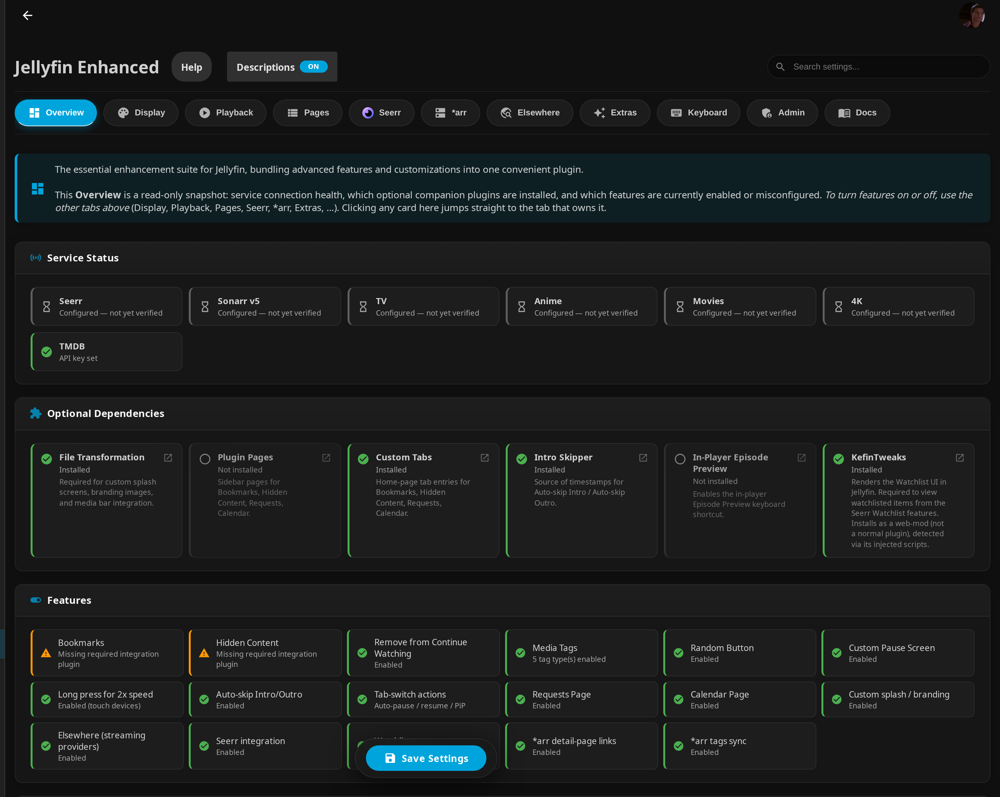

# Installation Guide

<!-- use a custom title -->
!!! info "Prerequisites"

    **Prerequisites:**

    - Jellyfin server version 10.11.x
    - Admin access to your Jellyfin server
    - Modern web browser (Chrome, Firefox, Edge, Safari)


## Standard Installation

### Step 1: Add Plugin Repository

1. In Jellyfin, navigate to **Dashboard** → **Plugins** → **Manage Repositories**
2. Click **➕** (Add button) to add a new repository
3. Give the repository a name (e.g., "Jellyfin Enhanced")
4. Set the **Repository URL** to the manifest:
   ```
   https://raw.githubusercontent.com/n00bcodr/jellyfin-plugins/main/10.11/manifest.json
   ```

5. Click **Save**

### Step 2: Install Plugin

1. Go to the **All** tab
2. Find **Jellyfin Enhanced** in the plugin list
3. Click **Install**
4. Wait for the installation to complete

### Step 3: Install File Transformation Plugin (Recommended)

<!-- use a custom title -->
!!! info "Important"

    **It is highly recommended to install the [File Transformation plugin](https://github.com/IAmParadox27/jellyfin-plugin-file-transformation)**

    Why?

    - The File Transformation plugin helps avoid permission issues while modifying `index.html`
    - Recommended on all installation types:
        - Docker
        - Windows
        - Linux
        - etc
    - Without it, you may encounter permission errors


1. In the **Catalog** tab, search for "file-transformation"
2. Install the **File Transformation** plugin
3. Restart your Jellyfin server
4. Then install Jellyfin Enhanced normally


If you do not have file-transformation installed, you might encounter permission issues. Refer [troubleshooting steps](troubleshooting.md)

### Optional Companion Plugins

Jellyfin Enhanced works on its own, but a few optional plugins unlock extra functionality. Install only the ones you need:

| Plugin | Needed for |
|--------|------------|
| [Plugin Pages](https://github.com/IAmParadox27/jellyfin-plugin-pages) | Sidebar pages (Calendar, Requests, Bookmarks, Hidden Content) |
| [Custom Tabs](https://github.com/IAmParadox27/jellyfin-plugin-custom-tabs) | Embedding Jellyfin Enhanced pages as custom navigation tabs |
| [Intro Skipper](https://github.com/intro-skipper/intro-skipper) | Auto-skip intro/outro (required only for that feature) |
| [Kefin Tweaks](https://github.com/ranaldsgift/KefinTweaks) | Watchlist UI (only if you use the watchlist integration) |

All of the above are available from the **Catalog** tab once their repositories are added. None are required for core Jellyfin Enhanced features.

### Step 4: Restart Server

1. **Restart** your Jellyfin server to complete the installation *(This is required for the plugin to take effect)*

### Step 5: Verify Installation

After restart:

1. Refresh your browser *(`Ctrl+F5` or `Cmd+Shift+R`)*
2. Access the Jellyfin Enhanced settings panel. Options:
    - In the sidebar: **Jellyfin Enhanced**
    - Press `?`
3. If you see the panel, installation was successful!

You can also confirm everything is wired up from **Dashboard → Plugins → Jellyfin Enhanced**. The **Overview** tab shows service-connection health and which optional companion plugins were detected:

