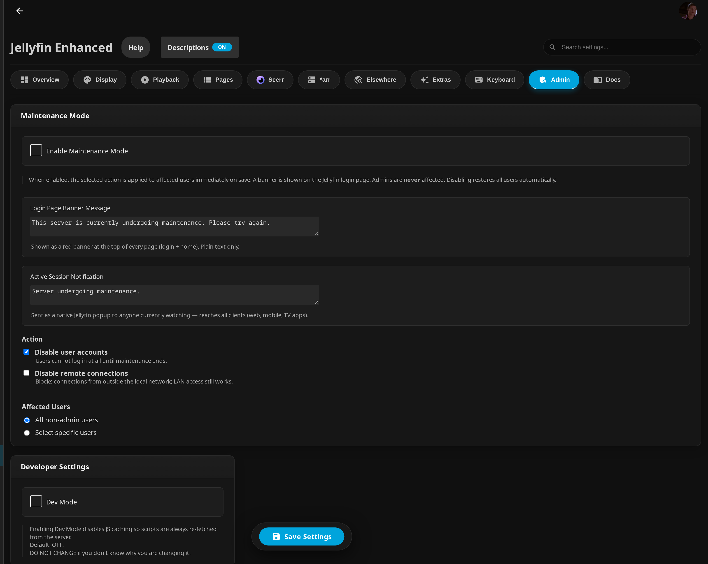
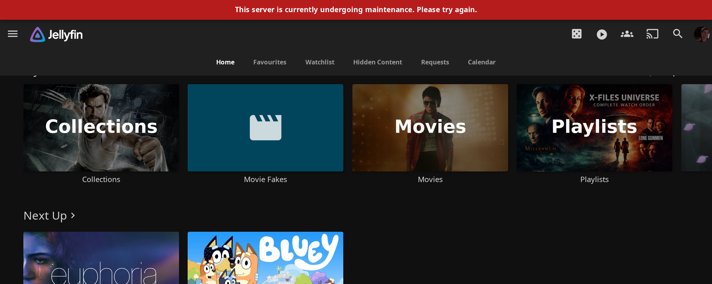

# Other Features

Additional features including custom branding, extras, icons, and more.

## Table of Contents

- [Custom Branding](#custom-branding)
- [Icon Settings](#icon-settings)
- [Extras](#extras)
- [Maintenance Mode](#maintenance-mode)
- [Timeout Settings](#timeout-settings)
- [Letterboxd Integration](#letterboxd-integration)
- [Hidden Content](#hidden-content)
- [Splash Screen](#splash-screen)
- [Internationalization](#internationalization)

!!! note "Where these settings live"
    The configuration page is split into tabs (**Overview**, **Display**, **Playback**, **Pages**, **Seerr**, ***arr**, **Elsewhere**, **Extras**, **Keyboard**, **Admin**, **Docs**). Most of the features on this page are under the **Extras** tab, while **Maintenance Mode** and **Dev Mode** are under the **Admin** tab.

---

## Custom Branding

Upload your own logos, banners, and favicon to personalize your Jellyfin instance. In the configuration page these uploads live under the **Extras** tab, in the **Custom Image Assets** section.

### Features

- Custom Jellyfin logo (header)
- Custom splash banners (light/dark themes)
- Custom favicon (browser tab icon)
- Apple touch icon (iOS Home Screen)
- Files stored in plugin config folder
- Survives Jellyfin updates

### Setup

**Prerequisites:**

- [File Transformation plugin](https://github.com/IAmParadox27/jellyfin-plugin-file-transformation) installed — this is what replaces Jellyfin's default web logos at request time. (The **Splash Screen Image URL** override below works without it.)

**Configuration:**

1. Go to **Dashboard** → **Plugins** → **Jellyfin Enhanced**
2. Navigate to the **Extras** tab
3. Find the **Custom Image Assets** section
4. Drop or upload your custom images into each card:
   - **Icon Transparent** - The icon in the top-left beside the server version (recommended 536×536px, PNG with transparency)
   - **Favicon** - Favicon in the browser tab (recommended 256×256px; ICO, PNG, or SVG)
   - **Banner Dark** - Splash screen banner for **Light Mode** (recommended 1302×378px; PNG, JPG, or WebP)
   - **Banner Light** - Splash screen banner for **Dark Mode** (recommended 1302×378px; PNG, JPG, or WebP)
   - **Apple Touch Icon** - Icon shown when adding to the iOS Home Screen (recommended 180×180px, PNG)
5. Click **Save**
6. Force refresh browser (Ctrl+F5)

!!! note
    The banner names are intentional: **Banner Dark** is used by the Light Mode login screen, and **Banner Light** is used by the Dark Mode login screen.

### Storage Location

Files stored in:
```text
/plugins/configurations/Jellyfin.Plugin.JellyfinEnhanced/custom_branding/
```

This location survives Jellyfin server and web updates.

---

## Icon Settings

Configure icon display throughout the plugin interface.

Found under the **Display** tab.

### Use Icons in UI

Enable or disable icons in toasts, settings panel headers, and other UI elements.

**Enable:**

1. Go to **Dashboard** → **Plugins** → **Jellyfin Enhanced**
2. Navigate to the **Display** tab
3. Check **"Use Icons in UI"**
4. Click **Save**

### Icon Style

Choose between different icon sets.

**Available Styles:**

- **Emoji** - Unicode emoji characters (default)
- **Lucide Icons** - Modern, clean icon set
- **Material UI Icons** - Google Material Design icons

**Configuration:**

1. Select icon style from dropdown
2. Click **Save**
3. Refresh browser to see changes

**Considerations:**

- Emoji - Universal, no loading required
- Lucide - Clean, modern aesthetic
- Material UI - Familiar Google design

---

## Extras

A collection of optional UI tweaks and integrations. All of these live under the **Extras** tab of the configuration page and are **off by default**.

### Colored Dashboard Icons

Replaces the default Dashboard activity icons with Material Design icons on colored backgrounds, so each activity type is easier to tell apart at a glance.


**Features:**

- Material Design icon and a distinct background color per activity type (logins, failed logins, plugin installs/updates/removals, user created/deleted/locked out, password changes, downloads, playback started/finished, errors, and more)
- Applies only on **Dashboard → Activity** (the activity & alerts list)
- Multi-language aware: it matches the localized activity text, so the icons work in **English, Catalan, Polish, German, French, Spanish, Italian, Japanese, Russian, Brazilian Portuguese, Dutch, Korean, Swedish, and Turkish**

**Enable:**

1. Go to **Dashboard** → **Plugins** → **Jellyfin Enhanced**
2. Navigate to the **Extras** tab
3. Check **"Colored Dashboard Icons"** (`ColoredActivityIconsEnabled`)
4. Click **Save**

### Colored Ratings Backgrounds

Applies color-coded backgrounds to the **content / age rating** badge (the official certification such as PG-13, TV-MA, 18, NR) on item detail pages.


**Features:**

- A distinct background color per certification, loaded from an external stylesheet on jsDelivr (`https://cdn.jsdelivr.net/gh/n00bcodr/Jellyfin-Enhanced@main/css/ratings.css`)
- Normalizes common variants — *Not Rated*, *Not-Rated*, *Unrated*, and *No Rating* all become **NR** (while *Approved* and *Passed* are kept as-is)
- Adds accessible `aria-label` and `title` attributes to each rating badge

!!! note
    This styles the **certification / age rating**, not third-party review scores (it does not affect TMDB, IMDb, or Rotten Tomatoes numbers).

**Enable:**

1. Navigate to the **Extras** tab
2. Check **"Colored Ratings Backgrounds"** (`ColoredRatingsEnabled`)
3. Click **Save**

### Profile Picture on Login

Shows the selected user's profile picture on the **manual** login screen instead of the typed name. When a user is selected, their avatar appears above the password field.


**Features:**

- Displays the user's avatar above the password field and hides the username input once a user is chosen
- Progressive loading: avatars on the account-selection screen first show a small blurred placeholder, then sharpen as the full-resolution image loads
- Manual-login only — it runs on the manual login form and does nothing once a user is logged in
- Automatic fallback: if a selected user has no avatar (or the image fails to load), the normal username field is restored

**Enable:**

1. Navigate to the **Extras** tab
2. Check **"Profile Picture on Login"** (`EnableLoginImage`)
3. Click **Save**

### Custom Plugin Menu Icons

Replaces the default folder icons next to plugins in the **Dashboard sidebar** with custom icons, and can add your own custom links to other plugin configuration pages.


**Features:**

- Replaces the sidebar icon for recognized plugins (when installed): Jellyfin Enhanced, JavaScript Injector, Intro Skipper, Reports, Jellysleep, Home Screen Sections, File Transformation, Newsletters, Segment Editor, and Jellyfin Helper
- Lets you add your own sidebar links to any plugin's configuration page, each with a Material icon
- Includes a **Test Links** button to preview your custom links before saving (test links appear immediately and disappear on page refresh)

**Enable:**

1. Navigate to the **Extras** tab
2. Check **"Custom Plugin Menu Icons"** (`PluginIconsEnabled`)
3. Click **Save**

**Sidebar Custom Links (`CustomPluginLinks`):**

Add one entry per line in the **Sidebar Custom Links** box. Each line is the configuration-page name and a [Material icon](https://fonts.google.com/icons?icon.set=Material+Icons) name, separated by a pipe:

```text
Configuration Page Name | Material Icon Name
```

- The **second field is a Material icon name**, not a URL.
- Each link always points to that plugin's own configuration page — internally it routes to `#/configurationpage?name=<Page Name>`. You cannot point a link at an arbitrary external URL.
- Use the exact name that appears in the configuration-page URL. For example, a URL containing `Jellyfin%20Tweaks` means you enter `Jellyfin Tweaks`.

**Example:**

```text
Jellyfin Tweaks | tune
Reports | insert_chart_outlined
```

### Metadata Icons

Replaces text metadata on item pages (such as codecs, resolution, and other media details) with icons, using the community [Druidblack/jellyfin-icon-metadata](https://github.com/Druidblack/jellyfin-icon-metadata) icon set. The plugin injects that project's stylesheet (`public-icon.css`) from a CDN when the option is enabled.

**Setup:**

1. Go to **Dashboard → Plugins → Jellyfin Enhanced → Extras**.
2. Enable **"Enable Metadata Icons (Druidblack)"** (off by default).
3. Save and refresh.

!!! note
    When Metadata Icons is enabled, the plugin also forces its own **Letterboxd** and ***arr** links to display as icons rather than text (it turns off "Show Letterboxd Link as Text" and "Show *arr Links as Text" automatically) so the page stays visually consistent.

### Theme Selector (Jellyfish)

Adds a theme selector that quickly switches between the [Jellyfish](https://github.com/n00bcodr/Jellyfish) color themes. The selector appears on the **Jellyfin user profile / preferences page** (next to your username), not in the Enhanced panel.


**Features:**

- One-click switching between Jellyfish color themes (the page reloads to apply the selected theme)
- A **Daily** toggle (shuffle button) that picks a new random theme automatically once per day
- The chosen theme is stored per user in the browser's local storage

!!! note
    This only changes the color theme of Jellyfish when used **natively**, not when Jellyfish is loaded through KefinTweaks.

**Enable:**

1. Navigate to the **Extras** tab
2. Check **"Theme Selector (Jellyfish)"** (`ThemeSelectorEnabled`)
3. Click **Save**

**Usage:**

1. Open your Jellyfin **user profile / preferences** page
2. Find the **Theme** row (palette icon)
3. Select a theme from the dropdown — the page reloads to apply it
4. Optional: click the shuffle button to toggle **Daily** random theme

**Available Themes:**

`Default`, `Aurora`, `Banana`, `Coal`, `Coral`, `Forest`, `Grass`, `Jellyblue`, `Jellyflix`, `Jellypurple`, `Lavender`, `Midnight`, `Mint`, `Ocean`, `Peach`, `Watermelon`.

### Active Streams Header Widget

Adds a live stream counter to the Jellyfin header. Click it to open a panel showing who is currently playing, what they are watching, playback state, progress, and transcoding details. **By default the widget is only visible to admin accounts.**


#### Configuration

1. Go to **Dashboard** → **Plugins** → **Jellyfin Enhanced**
2. Navigate to the **Extras** tab
3. Enable **"Active Streams Header Widget"**
4. Optional: enable **"Show widget to non-admins"**
5. Click **Save**

| Setting | Default | Description |
|---|---|---|
| **Active Streams Header Widget** (`ActiveStreamsEnabled`) | Off | Adds the stream counter icon to the Jellyfin header |
| **Show widget to non-admins** (`ActiveStreamsAllUsers`) | Off | When enabled, non-admin users also see the widget (read-only: no broadcast button, and no IP addresses) |

#### The header icon

The icon and its badge reflect current activity:

- **Nothing playing** - a neutral "ready" icon with no badge
- **Streams playing** - an accented icon with a count badge (a single-person icon for one stream, a group icon for several); the tooltip also notes how many are paused
- **All paused** - a pause icon with the count
- **Fetch failed** - a red icon

The panel does not poll continuously — it fetches once on load, and refreshes when you open the panel or press the refresh button.

#### Session cards & badge legend

Each active session is shown as a card with a poster, title (clickable, opens the item), playback state, a progress bar, and the watching user (avatar, username, client, and device). Badges describe how the stream is being delivered:

| Badge | Meaning |
|---|---|
| **Direct Play** (green) | The file is streamed as-is, no transcoding. Followed by neutral badges for the source video codec and bitrate. |
| **Transcoding** (amber) | The server is transcoding. Followed by neutral badges for the output video/audio codec, bitrate, resolution, and frame rate. |
| **Codec / resolution badges** (neutral) | Technical details of the stream (e.g. `H264`, `AAC`, `4.5 Mbps`, `1920×1080`, `24fps`). |
| **Transcode reason badges** (red, italic) | Why transcoding was triggered (e.g. *Audio Codec Not Supported*). For codec mismatches it also shows the conversion, e.g. `EAC3 → AAC`. |

On the progress bar, an **amber buffer layer** behind the playback position shows how far the server has transcoded ahead of the current play position.

!!! info "IP addresses are admin-only"
    The remote IP address (router icon) is only included for admins — it is stripped from the response server-side for non-admin users.

#### Broadcasting a message (admins only)

Admins get a **broadcast** button (megaphone icon) in the panel header. It sends a native Jellyfin notification to all active sessions (web, mobile, and TV clients):

| Field | Required | Description |
|---|---|---|
| **Title** | No | Optional heading (max 200 characters); may not display on web UI clients |
| **Message** | Yes | The message body (max 1000 characters); always visible on all clients |
| **Timeout (s)** | Yes | Seconds before the notification auto-dismisses (default: 10) |

After sending, the panel reports how many sessions received it (e.g. "Sent to 3 of 4 sessions").

!!! warning
    The Title field may not render on the Jellyfin web client. Always put the important information in the Message field.

---

## Maintenance Mode

A server-side admin tool that temporarily restricts non-admin access while you work on the server, and shows everyone a banner explaining why. It lives under the **Admin** tab of the configuration page.



**Admins are never affected**, and disabling maintenance mode automatically restores every user it changed.

### How it works

When you enable maintenance mode and save, the plugin immediately applies the chosen action to the affected users, records exactly which users it changed (in a `maintenance-state.json` file in the plugin config folder), and shows a banner. When you later disable it, the plugin restores only the users it had changed, back to their previous state.

### The banner

While maintenance mode is active, a **red banner** is shown fixed across the top of every page (login and home) for all users, including admins. The page content shifts down so the banner doesn't overlap the header.



### Features & settings

| Setting | Description |
|---|---|
| **Enable Maintenance Mode** (`MaintenanceModeEnabled`) | Turns maintenance mode on. The selected action is applied to affected users immediately on save; disabling restores them automatically. |
| **Login Page Banner Message** (`MaintenanceModeMessage`) | Plain-text message shown in the red banner at the top of every page (login + home). Default: "This server is currently undergoing maintenance. Please try again." |
| **Active Session Notification** (`MaintenanceModeNotificationMessage`) | A native Jellyfin popup sent to anyone currently watching, reaching all clients (web, mobile, TV apps). Default: "Server undergoing maintenance." |
| **Action** (`MaintenanceModeAction`) | What to apply. **Disable user accounts** (`disable_accounts`) — affected users cannot log in at all until maintenance ends. **Disable remote connections** (`disable_remote`) — blocks connections from outside the local network; LAN access still works. Selecting both checkboxes applies `both`. |
| **Affected Users** (`MaintenanceModeAffectedUsers`) | **All non-admin users** (`all`, the default) or **Select specific users** — a checklist of non-admin users with Select-All / Deselect-All helpers. |

### Turning it off / auto-restore

Maintenance mode stays active until you uncheck **Enable Maintenance Mode** and save. When you do, every user it had disabled (accounts and/or remote access) is automatically restored to its previous state. Re-saving while it is already active only updates the message; it does not re-apply changes to users.

!!! note
    Internally the feature also supports an automatic time-limited window, but the configuration page does not currently expose a duration field — maintenance mode is enabled until you turn it off.

---

## Timeout Settings

Configure durations for Enhanced panel UI elements. These fields are on the **Playback** tab.

### Shortcuts Panel Autoclose Delay

Control how long the shortcuts (help) panel stays open before automatically closing.

**Configure:**

1. Go to **Dashboard** → **Plugins** → **Jellyfin Enhanced**
2. Navigate to the **Playback** tab
3. Set **Shortcuts Panel Autoclose Delay (ms)** (`HelpPanelAutocloseDelay`)
4. Click **Save**

**Default:** 15000 ms (15 seconds)

A **Preview autoclose** button next to the field lets you test the timing.

### Toast Notification Duration

Control how long toast notifications are displayed.

**Configure:**

1. On the **Playback** tab, set **Toast Notification Duration (ms)** (`ToastDuration`)
2. Click **Save**

**Default:** 1500 ms (1.5 seconds)

**Affects:**

- Bookmark saved notifications
- Success/error messages
- State change confirmations

---

## Letterboxd Integration

Adds a Letterboxd external link to Movie and Series detail pages, in the external-links row.

### Setup

1. Go to **Dashboard** → **Plugins** → **Jellyfin Enhanced**
2. Navigate to the **Extras** tab (under **External Links**)
3. Check **"Enable Letterboxd Links"** (`LetterboxdEnabled`)
4. Optional: Check **"Show link as text"** (`ShowLetterboxdLinkAsText`) for a text link instead of the Letterboxd icon
5. Click **Save**

### Usage

1. Open a Movie or Series detail page
2. Look for the Letterboxd link in the external-links section
3. Click it to open the title on Letterboxd

**Features:**

- Uses the item's **IMDb ID** to build the link (`https://letterboxd.com/imdb/{imdbId}`), which Letterboxd resolves to the correct page
- Requires an IMDb ID to be present in the item's existing external links — items without one get no Letterboxd link
- Icon or text display option

!!! note
    The link is built from the **IMDb ID**, not the TMDB ID. If the **Metadata Icons (Druidblack)** option is enabled, the Letterboxd link is shown as an icon to match the other metadata icons.

---

## Hidden Content

Hide specific items from your Jellyfin library without deleting them.

### Features

- Hide movies, shows, or episodes
- Hidden items don't appear in library
- Easily unhide items later
- Per-user hidden content
- Manage via Enhanced panel or dedicated page

### Setup

1. Go to **Dashboard** → **Plugins** → **Jellyfin Enhanced**
2. Navigate to the **Pages** tab
3. Find the **Hidden Content** section
4. Check **"Enable Hidden Content"**
5. Optional: enable using Plugin Pages for the dedicated Hidden Content library

   - Adds a sidebar link to a dedicated Hidden Content page
   - Requires the [Plugin Pages](https://github.com/IAmParadox27/jellyfin-plugin-pages) plugin
   - Restart Jellyfin after enabling for the first time
6. Click **Save**

### Usage

**Hide Item:**

1. Open item detail page
2. Click hide button (if available)
3. Item removed from library view

**Manage Hidden Items:**

**Via Enhanced Panel:**

1. Open Enhanced panel (press `?`)
2. Go to Hidden Content section
3. View all hidden items
4. Click to unhide

**Via Dedicated Page** (if enabled):
1. Click "Hidden Content" in sidebar
2. View all hidden items with thumbnails
3. Search and filter hidden items
4. Click to unhide

**Note:** Hidden items are per-user and don't affect other users.

---

## Splash Screen

A custom splash screen — your image on a black background with an animated progress bar — that appears while Jellyfin loads. The controls are under the **Extras** tab, in the **Custom Image Assets** section. This override works **without** the File Transformation plugin.

### Setup

1. Go to **Dashboard** → **Plugins** → **Jellyfin Enhanced**
2. Navigate to the **Extras** tab
3. Check **"Enable Splash Screen Override"** (`EnableCustomSplashScreen`)
4. Enter a **Splash Screen Image URL**

   - Use a full URL or a relative path
   - Default: `/web/assets/img/banner-light.png`
5. Click **Save**

### How it works

- Shows your image centered on a black screen with a progress bar that animates toward (but stops at) 95% until the UI is ready, then fills to 100% and fades out
- Hides as soon as the core Jellyfin UI is detected (login form, home sections, etc.)
- **Hard timeout:** if the UI is never detected, the splash force-hides after **20 seconds** so it can't get stuck
- **Blocks competing splash screens:** it suppresses and removes other loaders (for example the media-bar plugin's loader) so only one splash shows

### Image Requirements

- **Format:** any browser-supported image (PNG, JPG, SVG, WebP)
- **Location:** reachable from the URL/path you enter (web root or an external URL)

!!! warning
    The splash override may behave oddly if the [jellyfin-plugin-media-bar](https://github.com/IAmParadox27/jellyfin-plugin-media-bar) plugin is installed, since both try to control the loading screen.

---

## Internationalization

Multi-language support with community translations.

### Supported Languages

<p align="left">
  <a href="https://hosted.weblate.org/engage/jellyfinenhanced/">
    
  </a>
</p>

### How It Works

- Automatically detects Jellyfin user profile language
- Fetches latest translations from GitHub on first load
- Caches translations for 24 hours
- Falls back to bundled translations if offline
- Clears outdated caches on plugin update

### Default Language Override

Set a default language for all users.

**Configuration:**

1. Go to **Dashboard** → **Plugins** → **Jellyfin Enhanced**
2. On the **Display** tab, find the **Default UI Language** setting
3. Select a language from the dropdown
4. Leave empty to use each user's Jellyfin profile language
5. Click **Save**

### Contributing Translations

See the [Contributing Translations](../faq-support/contributing-translations.md) section for details.

**Translation Updates:**

- Fetched from GitHub on first load
- Available immediately after merge
- No plugin update needed
- Cached per plugin version

---

## Cache Management

### Clear All Client Caches

Forces every connected client to clear its cached data (such as the quality/genre tag caches) on the next page load.

**Use Case:**

- Apply updated tag/cache data after changing settings
- Fix cached or corrupted client-side data
- Force a fresh start across all clients

**How:**

1. On the **Display** tab, find the **Clear All Client Caches** button (a **Clear all client tag caches** quick action is also available on the **Overview** tab)
2. Confirm the prompt — a cache-clear signal is sent to all clients
3. Clients clear their caches on the next page load

**Note:** May cause slowness on first load after clearing.

---

## Support

If you encounter issues:

1. Check [FAQ](../faq-support/faq.md) for common solutions
2. Verify settings are correct
3. Check browser console for errors
4. Report issues on [GitHub](https://github.com/n00bcodr/Jellyfin-Enhanced/issues)
