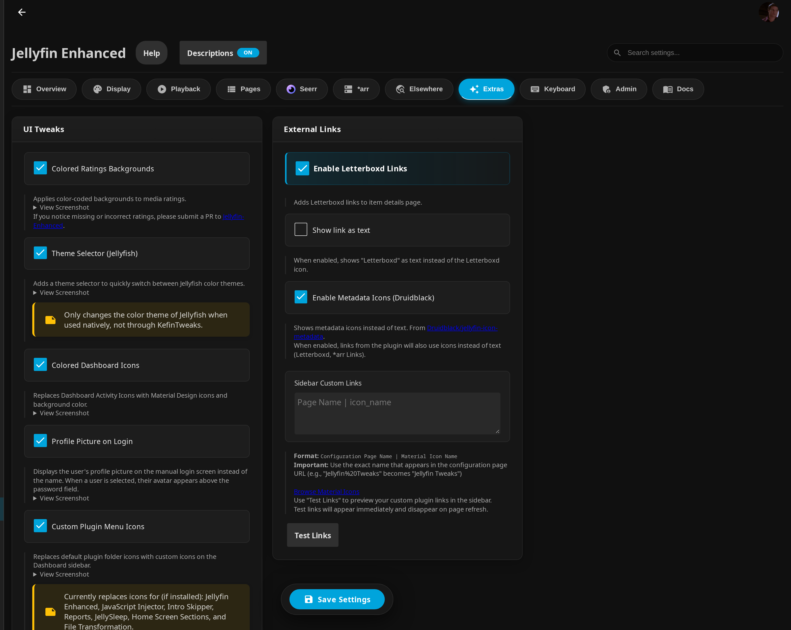

# Other Settings

Settings for custom branding, icon styles, extras, maintenance, and more, in the plugin configuration page (**Dashboard** → **Plugins** → **Jellyfin Enhanced**).

The configuration page is organized into tabs: **Overview**, **Display**, **Playback**, **Pages**, **Seerr**, ***arr**, **Elsewhere**, **Extras**, **Keyboard**, **Admin**, and **Docs**. The settings on this page are mostly under the **Extras** tab; **Maintenance Mode** and **Dev Mode** are under the **Admin** tab.

---

## Custom Branding

Upload your own logos, banners, and favicon to personalize your Jellyfin instance. Found under the **Extras** tab, in the **Custom Image Assets** section.

!!! info "Requirements"
    Uploading the icon / favicon / logo images requires the [File Transformation plugin](https://github.com/IAmParadox27/jellyfin-plugin-file-transformation) to be installed. (The **Splash Screen Image URL** override works without it.)

| Setting | Recommended | Description |
|---|---|---|
| **Icon Transparent** | 536×536px, PNG w/ transparency | The icon in the top-left beside the server version |
| **Favicon** | 256×256px, ICO/PNG/SVG | Browser tab icon |
| **Banner Dark** | 1302×378px, PNG/JPG/WebP | Splash banner for **Light Mode** |
| **Banner Light** | 1302×378px, PNG/JPG/WebP | Splash banner for **Dark Mode** |
| **Apple Touch Icon** | 180×180px, PNG | Icon shown when adding to the iOS Home Screen |

!!! note
    The banner names map to the opposite theme: **Banner Dark** is used by Light Mode, and **Banner Light** is used by Dark Mode.

After saving, do a hard refresh (++ctrl+f5++) to see changes.

---

## Icon Settings

Found under the **Display** tab.

### Use Icons in UI

Enable or disable icons in toasts, settings panel headers, and other UI elements (`useIcons`).

### Icon Style

Choose the icon set used throughout the plugin UI (`iconStyle`, default **Emoji**).

| Style | Description |
|---|---|
| **Emoji** | Unicode emoji characters — universal, no loading required |
| **Lucide Icons** | Modern, clean icon set |
| **Material UI Icons** | Google Material Design icons |

---

## Extras Tab

The **Extras** tab groups optional UI tweaks and integrations. All are **off by default**.

### UI Tweaks

| Setting | Default | Description |
|---|---|---|
| **Colored Ratings Backgrounds** (`ColoredRatingsEnabled`) | Off | Color-codes the content/age rating badge on detail pages |
| **Theme Selector (Jellyfish)** (`ThemeSelectorEnabled`) | Off | Adds a Jellyfish color-theme picker to the user profile page |
| **Colored Dashboard Icons** (`ColoredActivityIconsEnabled`) | Off | Material icons + colors on Dashboard → Activity |
| **Profile Picture on Login** (`EnableLoginImage`) | Off | Shows the selected user's avatar on the manual login screen |
| **Custom Plugin Menu Icons** (`PluginIconsEnabled`) | Off | Replaces plugin folder icons in the Dashboard sidebar |
| **Enable Metadata Icons (Druidblack)** (`MetadataIconsEnabled`) | Off | Shows item metadata as icons instead of text via the Druidblack icon set; also forces Letterboxd/*arr links to icon mode |
| **Active Streams Header Widget** (`ActiveStreamsEnabled`) | Off | Adds a live stream counter to the header |
| **Show widget to non-admins** (`ActiveStreamsAllUsers`) | Off | Lets non-admins see a read-only Active Streams view (no broadcast, no IP addresses) |

### External Links

| Setting | Default | Description |
|---|---|---|
| **Enable Letterboxd Links** (`LetterboxdEnabled`) | Off | Adds a Letterboxd link (built from the IMDb ID) to Movie/Series detail pages |
| **Show link as text** (`ShowLetterboxdLinkAsText`) | Off | Shows "Letterboxd" as text instead of the icon |
| **Sidebar Custom Links** (`CustomPluginLinks`) | empty | One entry per line, `Configuration Page Name \| Material Icon Name` — links to that plugin's config page |

See [Other Features — Active Streams Header Widget](other-features.md#active-streams-header-widget) and [Custom Plugin Menu Icons](other-features.md#custom-plugin-menu-icons) for full details.

---

## Maintenance Mode

Server-side admin tool (under the **Admin** tab) that restricts non-admin access and shows everyone a red banner. Admins are never affected; disabling it restores all changed users automatically.

| Setting | Default | Description |
|---|---|---|
| **Enable Maintenance Mode** (`MaintenanceModeEnabled`) | Off | Applies the selected action to affected users immediately on save |
| **Login Page Banner Message** (`MaintenanceModeMessage`) | "This server is currently undergoing maintenance. Please try again." | Plain-text red banner shown at the top of every page |
| **Active Session Notification** (`MaintenanceModeNotificationMessage`) | "Server undergoing maintenance." | Native popup sent to users currently watching (all clients) |
| **Action** (`MaintenanceModeAction`) | `disable_accounts` | **Disable user accounts**, **Disable remote connections**, or both |
| **Affected Users** (`MaintenanceModeAffectedUsers`) | `all` | All non-admin users, or a selected subset |

See [Other Features — Maintenance Mode](other-features.md#maintenance-mode) for full details.

---

## Timeout Settings

Controls how long certain UI elements stay visible before auto-closing. Found under the **Playback** tab.

| Setting | Default | Description |
|---|---|---|
| **Shortcuts Panel Autoclose Delay (ms)** (`HelpPanelAutocloseDelay`) | 15000 ms | How long the shortcuts (help) panel stays open before closing automatically. |
| **Toast Notification Duration (ms)** (`ToastDuration`) | 1500 ms | How long toast notifications are displayed. |

---

## Letterboxd Integration

Adds a Letterboxd external link to Movie and Series detail pages (built from the item's IMDb ID). Found under the **Extras** tab → **External Links**.

| Setting | Description |
|---|---|
| **Enable Letterboxd Links** (`LetterboxdEnabled`) | Shows a Letterboxd icon/link on Movie and Series pages |
| **Show link as text** (`ShowLetterboxdLinkAsText`) | Displays the link as text instead of an icon |

---

## Splash Screen

Shows a custom image with a progress bar while Jellyfin is loading. Found under the **Extras** tab → **Custom Image Assets**. Works without the File Transformation plugin.

| Setting | Description |
|---|---|
| **Enable Splash Screen Override** (`EnableCustomSplashScreen`) | Enables the custom splash screen |
| **Splash Screen Image URL** (`SplashScreenImageUrl`) | Full URL or relative path to the image. Defaults to `/web/assets/img/banner-light.png` |

The splash hides as soon as the core UI is detected, or after a 20-second hard timeout. It also suppresses other plugins' loaders. See [Other Features — Splash Screen](other-features.md#splash-screen) for full details.

---

## Default UI Language

Override the language used by the plugin for all users (the **Default UI Language** dropdown, `DefaultLanguage`).

- Leave empty to use each user's Jellyfin profile language.
- Selecting a language sets it as the default for everyone.

---

## Cache Management

| Button | Effect |
|---|---|
| **Clear All Client Caches** | Forces every connected client to clear its cached data (such as quality/genre tag caches) on the next page load. Use to apply updated data or fix corrupted client-side state. |

The **Clear All Client Caches** button is on the **Display** tab. A **Clear all client tag caches** quick action is also available on the **Overview** tab.
