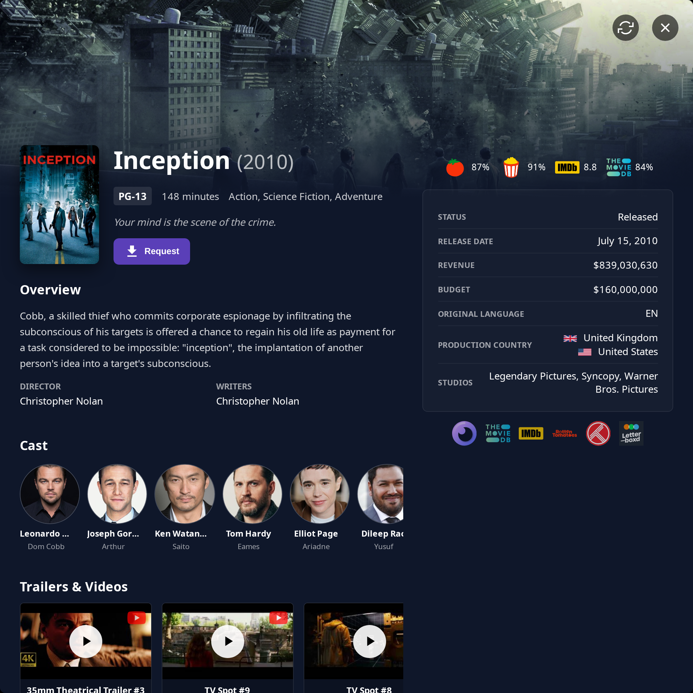
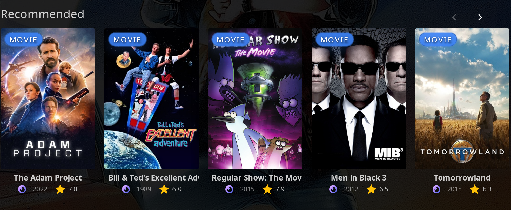

# Seerr Integration

Search, request, and discover media directly from Jellyfin using your Seerr instance.


!!! info "Note"

    **This plugin is NOT affiliated with Seerr.** Seerr is an independent project. This plugin simply integrates with it to enhance the Jellyfin experience.

    **Please report any issues with this plugin to the Jellyfin Enhanced repository, not to the Seerr team.**

## Features

- **Search + Request** — Seerr results appear directly in Jellyfin search, with request buttons and live status
    - **Collections in search** *(optional)* — request an entire TMDB collection at once
    - **4K Requests** and **4K TV Requests** *(optional)*
    - **Season selection** with partial requests
    - **Advanced requests** *(optional)* — choose server, quality profile and root folder
- **More Info modal** *(optional)* — an in-app details modal with seasons, download progress, ratings and Jellyfin links
- **Recommendations + Discovery** — similar/recommended on detail pages, plus genre/network/person/tag/collection discovery rows
- **Requests Page** — a dedicated page combining *arr downloads, Seerr requests and Seerr issues
- **Issue Reporting** — report video/audio/subtitle/other problems directly to Seerr
- **Auto-Requests** — automatically request the next movie in a collection or the next TV season based on viewing
- **Watchlist Sync** — keep watchlists in sync between Jellyfin and Seerr in both directions
- **User Import** — import Jellyfin users into Seerr automatically

!!! tip "How it works"

    To ensure security and prevent CORS errors, the plugin uses the Jellyfin server as a proxy. This keeps your Seerr API key safe and avoids browser security issues.

---

## Search Integration

When Seerr integration and **Show Seerr Results in Search** are enabled, a Seerr section is appended to the Jellyfin search results. Each result is a card showing the poster, release year, TMDB rating and a request button. Cards already in your library link straight to the Jellyfin item (their title turns green).

### Requesting

1. Type a search query in the Jellyfin search bar.
2. Results from both Jellyfin and Seerr appear; the Seerr section shows the request status of each item.
3. Click the request button to request, or click the card to open details (see [More Info modal](#more-info-modal) or open the item in Seerr, depending on your settings).

Search results are paginated with infinite scroll — additional pages load automatically as you scroll the Seerr section.

### Seerr-only filter

**Double-tap (or double-click) the Seerr icon** on the search page to toggle a Seerr-only view. This hides the native Jellyfin result sections and moves the Seerr section to the top, so you see only Seerr results. Double-tap again to restore the normal view. A toast confirms when the filter is turned on or off, and the section title changes between the discover and results titles.

### Collections in search

When **Show Collections in Seerr Results** is enabled, the plugin detects movies that belong to a TMDB collection (e.g. *Harry Potter*, *The Lord of the Rings*) and injects a dedicated **collection card** next to them. Movie cards that belong to a collection also get a small *"Part of …"* badge. Clicking a collection card opens a request dialog that lets you request the **entire collection at once**.

!!! note

    Collection detection uses TMDB. Falling back to TMDB for a movie's collection requires the **TMDB API Key** to be configured (shared with Elsewhere Settings).

### Manual refresh

The Seerr section header includes a **refresh button** (circular-arrows icon). Clicking it re-fetches the current query's results and rebuilds the section with up-to-date statuses, without retyping the search.

### 4K requests

4K requesting is opt-in and controlled by two independent settings:

- **Enable 4K Requests** — adds 4K support for movies
- **Enable 4K TV Requests** — adds 4K support for TV shows

When enabled, the request button becomes a **split button** with a down-chevron. The main button performs the standard (non-4K) request; the chevron opens a small popup to request in 4K.

=== "Movies"

    1. Enable **Enable 4K Requests** in plugin settings.
    2. Use the request button's chevron and choose **Request in 4K**.
    3. If advanced requests are enabled, the advanced modal opens in 4K mode; otherwise the 4K request is submitted directly and a *"4K request submitted successfully!"* toast appears.

=== "TV"

    1. Enable **Enable 4K TV Requests** in plugin settings.
    2. For a TV result, use the request button's chevron and choose **Request in 4K**.
    3. The season selection modal opens in 4K mode — its title gets a ` - 4K` suffix and the primary button reads **Request in 4K**.

The 4K option reflects the item's separate 4K status:

- **4K Available** — already available in 4K; the option is disabled.
- **4K Requested** — a 4K request is pending/processing; the option is disabled.
- **4K Blocklisted** — blocklisted in Seerr; the option is disabled.
- Otherwise the **Request in 4K** option is clickable.

### Advanced requests

When **Show advanced request options** is enabled, requesting opens a modal that lets users choose the destination **server**, **quality profile** and **root folder** before submitting.

!!! warning

    Advanced request options **disregard any Override Rules** configured in Seerr. With advanced options off, the plugin automatically applies your Seerr override rules (matching on language, genre, keywords and user) when submitting requests.

### Request status

The request button (and a small badge in the corner of each card) reflect the item's Seerr media status. The labels and colors map to Seerr's internal status values:

| Display | Meaning |
| :--- | :--- |
| **Request** | Not yet requested — click to request. (Items previously deleted from Seerr are requestable again.) |
| **Pending** | Request submitted, awaiting admin approval. |
| **Requested** | Approved and queued, but not actively downloading. |
| **Processing** | Actively downloading (animated). |
| **Partially Available** | Some seasons/parts are available; others are still pending. |
| **Available** | Already in your library (button disabled). |
| **Blocklisted** | Blocklisted in Seerr (button disabled). |

For TV shows the button summarizes season state — e.g. **Request Missing** when only some seasons are available, or **Request More** when seasons were previously available but later removed. When all seasons are available the button shows **Available** and is disabled.

!!! note "Connection state on the button"

    If Seerr is unreachable the button shows **Offline**; if your Jellyfin user is not linked to a Seerr account it shows **User not found**. In both cases the button is disabled.

### Request quotas

If a request exceeds your Seerr quota, the plugin shows a themed dialog (rather than a generic error) explaining the quota that was hit, your current usage, and when it resets. The advanced/season request modals can also show a small **quota chip** with your remaining allowance, warning when you are close to your limit.

Quota information and the quota dialog are only shown when **Show request quota info** is enabled.

---

## More Info modal

When **Open results in "More Info" modal** is enabled, clicking a Seerr result's title or poster opens an in-app details modal instead of opening Seerr in a new tab.



The modal shows:

- **Poster, title, year, runtime, genres, tagline and overview**
- A **region-aware content rating** badge (uses your configured default region, falling back to `US`)
- **Cast, crew, trailers and keywords**
- A right-hand panel with **ratings** — Rotten Tomatoes critics (Tomatometer) and audience scores, IMDb, and the TMDB user score — each linking out to the respective site
- **Status chip** showing the current Seerr status
- **Inline download progress bars** for items currently downloading (showing percentage, status and ETA, combining standard and 4K downloads)
- For TV shows, a **Seasons** section

### Seasons in the modal

Each season card shows its poster, name, episode count, air year and overview. Missing metadata is backfilled from TMDB (requires the TMDB API Key).

When a season is available in your library, the card shows a clickable **Available** pill that links directly to that season in Jellyfin (`#!/details?id=…`). If the season exists in 4K, a separate **4K Available** pill is shown. A Seerr status that claims "available" but has no matching Jellyfin item is treated as stale, and no Available pill is shown.

### Requesting from the modal

The modal's request action mirrors the search split-button behavior:

- The primary button is **Request** (or **Request More** for a TV show that still has unrequested seasons), which opens the season selection modal.
- When 4K is enabled for the media type, a chevron opens a **Request in 4K** dropdown, with the same *4K Available / 4K Requested / 4K Blocklisted* disabled states described above.

### Refreshing the modal

The modal header has a **refresh button** (circular-arrows icon) that re-fetches the item's details and re-renders the status chip, download bars, request buttons and season links in place. The modal also refreshes automatically after a TV request is submitted for the same item.

---

## Item Details (Similar & Recommended)

On movie and series detail pages, the plugin can add **Similar** and **Recommended** rows sourced from Seerr, inserted after Jellyfin's *More Like This* section.



- **Show similar items** — adds a *Similar* row (up to 20 items).
- **Show recommended items** — adds a *Recommended* row (up to 20 items).

Each must be enabled individually; if both are off, nothing is added. Items already in your library link to the Jellyfin item and can be requested in-place from the row.

#### Filtering options

- **Exclude items already in library** — hides items already present in your Jellyfin library.
- **Exclude blocklisted items** — hides items marked as blocklisted in Seerr.

Hidden-content rules (from the Hidden Content feature) are also applied to these rows.

### "Request More" on series

When **Show "Request More" button on Series** is enabled (on by default), a **Request More** button is added beside the **Seasons** heading on a Series detail page whenever the show still has unrequested seasons in Seerr. Clicking it opens the season selection modal so users can request additional seasons without using the search bar.

---

## Discovery Pages

The plugin can inject "discover more" rows into existing Jellyfin browse pages, pulling extra content from Seerr.

### Available discovery types

| Type | Setting | Where it appears |
| :--- | :--- | :--- |
| **Genre** | Show "More Genre" *(on by default)* | Genre list pages |
| **Network / Studio** | Show "More from Network" *(off by default)* | Network/studio list pages |
| **Tag / Keyword** | Show "More Tag" *(on by default)* | Tag list pages |
| **Person** | Show "More from Actor" *(on by default)* | Actor/person detail pages |
| **Collection** | Show missing collection movies *(on by default)* | Collection (BoxSet) detail pages |

### Filtering & sorting

Genre, Network, Tag and Person rows include:

- **Media-type filter** — **All** / **Movies** / **Series** (shown only when the row contains both movies and TV).
- **Sort** dropdown — **Popular** (default), **Top Rated**, **Newest**, **Oldest**.

!!! note

    **Collection discovery** is different: it simply lists the movies *missing* from a collection (those not yet fully available), sorted by release date, and has no filter, sort or infinite scroll. Its heading reads *Missing from `<collection>` (`available`/`total`)*.

### Infinite scroll & retry

Discovery rows load more content as you scroll (Person discovery paginates the cast member's full filmography client-side; the others fetch additional pages from Seerr). If loading a page fails, the plugin retries automatically a few times with backoff. If it still fails, a **⟳ Tap to retry** button appears so you can retry manually.

Discovery rows respect the **Exclude items already in library** and **Exclude blocklisted items** options, as well as hidden-content rules.

---

## Issue Reporting

Report problems with media directly to Seerr.

### Issue types

The report modal offers four issue types (matching Seerr's own categories):

- **Video** (quality, corruption, wrong file)
- **Audio** (sync, missing tracks, quality)
- **Subtitles** (sync, missing, incorrect)
- **Other** (metadata, artwork, etc.)

### How to report

1. Open a movie or TV detail page.
2. Click the **report icon** (warning triangle) in the action buttons.
3. Select an issue type.
4. For TV, pick the affected **season** and **episode** (see preselect behavior below).
5. Enter a description.
6. Submit the report.

The modal also lists **existing issues** for the item, grouped by type (Video / Audio / Subtitles / Other). Each issue card shows its ID, an Open/Resolved status pill, the date, the reporter, the description and any follow-up **comments**.

### Season / episode preselect (TV)

- On a **Season** page, that season is preselected and the season selector is disabled.
- On an **Episode** page, both the season and episode are preselected and locked.
- Otherwise it defaults to *All seasons* (when the show has more than one season).
- **Special seasons (Season 0) are excluded** from the selectors.

### Open-issue indicator

When **Show open issue indicator** is enabled, the report button turns orange and shows a small count badge if the item already has open issues in Seerr (displayed as `9+` above nine).

!!! note "When the report button is hidden or disabled"

    - **Hidden entirely** for items that can't be reported — collections/boxsets, and **Season 0 / specials** seasons and episodes.
    - **Shown as a disabled button** when reporting isn't possible — when no TMDB ID can be resolved for the item, when Seerr is unavailable, or when the user lacks permission. The disabled button explains the reason on hover/click.
    - The feature requires both Seerr integration and **Show "Report Issue" button on items** to be enabled.

---

## Requests Page


Monitor active downloads from Sonarr/Radarr and manage Seerr requests and issues in one dedicated page.

### Setup

1. Go to **Dashboard** → **Plugins** → **Jellyfin Enhanced**.
2. Navigate to the **Seerr** tab.
3. Check **Enable Requests Page**.
4. Optionally check **Show Downloads in Requests Page** to display active *arr downloads.
5. Optionally check **Show Seerr Issues Section** to display Seerr issues beneath the requests.
6. Choose an integration method:
   - **Use Plugin Pages for Requests** — adds a sidebar link (requires the [Plugin Pages](https://github.com/IAmParadox27/jellyfin-plugin-pages) plugin)
   - **Use Custom Tabs for Requests** — adds a custom tab (requires the [Custom Tabs](https://github.com/IAmParadox27/jellyfin-plugin-custom-tabs) plugin)
7. Click **Save**.
8. Restart Jellyfin if using Plugin Pages.

### Usage

Access the Requests page via:

- The **Requests** sidebar link (Plugin Pages)
- The custom tab (Custom Tabs)
- The direct URL `/web/index.html#!/jellyfinenhanced/requests`

#### Features

- View active downloads from Sonarr/Radarr (if enabled), with progress bars, ETA, quality and size.
- View Seerr requests with status chips (Pending Approval, Requested, Processing, Declined).
- View reported Seerr issues (if enabled), filterable by status and paginated, with TMDB detail lookup; open the issue reporter modal directly from the list.
- Filter by status and search.
- **Approve / Decline buttons** — admins and users with the Manage Requests permission see green approve and red decline buttons on pending requests.

You can also restrict downloads to only the current user's own requests with **Filter Downloads by User Requests**.

---

## Auto-Requests

Automatically request media based on viewing behavior. Both auto-request features are **off by default**.

### Auto Movie Requests

When a user watches a movie that belongs to a TMDB collection, the plugin can automatically request the **next movie** in that collection.

Settings (under **Enable Auto Movie Requests**):

- **When movie starts** — trigger near the start of playback.
- **After X minutes watched** — trigger once the user has watched a configurable number of minutes (**Minutes Watched Threshold**, default **20**). You can enable either or both triggers.
- **Only request if released** — when on, the next movie is only requested if its release date has already passed (default: on).
- **Quality Profile Mode** — **Default**, **Original** (copy the watched movie's existing request profile), or **Custom** (pick a Radarr server, quality profile and root folder).
- **Use default instead of 4K fallback** — when *Original* mode would copy a 4K profile, fall back to the default profile instead.

The next movie is skipped if it is already available, pending or processing in Seerr.

!!! note

    Auto Movie Requests require the **TMDB API Key** to be configured (used to read the collection).

### Auto Season Requests

When a user is about to finish a TV season, the plugin can automatically request the **next season**.

Settings (under **Enable Automatic Advance Season Requests**):

- **Episodes Remaining Threshold** — request the next season when the number of remaining (unwatched) episodes is at or below this number (default **2**).
- **Require All Prior Episodes Watched** — when on, the next season is only requested if every earlier episode in the current season has been marked played.

The next season is skipped if it hasn't started airing yet (no episodes on TMDB), or if it is already available or requested in Seerr.

!!! tip

    Auto-requests fire on playback events: movies on playback start and/or progress, and seasons both as you start an episode and when an episode is finished (played to completion or watched past ~90%). Each check is de-duplicated for about an hour to avoid repeat requests.

---

## Watchlist Sync

Keep watchlists in sync between Jellyfin and Seerr. The plugin uses Jellyfin's native favorites/likes flag as the watchlist marker.

!!! note "Companion plugin"

    Under the hood the plugin marks watchlist items with Jellyfin's native favorites/likes flag, but Jellyfin has no built-in watchlist UI of its own. The [KefinTweaks](https://github.com/ranaldsgift/KefinTweaks) plugin is what renders the Jellyfin-side watchlist — and, for the **Sync Jellyfin Watchlist → Seerr** direction, it is what *provides* the watchlist being read. For that reason the plugin's own setting descriptions state that KefinTweaks is required to actually view or use the watchlisted items, and the config page shows a "KefinTweaks detected" badge once it is installed.

### Settings

- **Add requested media to Watchlist** — when a requested item becomes available in your library, it is automatically added to the requesting user's watchlist.
- **Sync Seerr Watchlist → Jellyfin** — adds each user's Seerr watchlist items to their Jellyfin watchlist (for items already in the library).
- **Sync Jellyfin Watchlist → Seerr** — pushes each user's Jellyfin watchlist items (that have a TMDB ID and a linked Seerr account) to their Seerr watchlist, skipping items already present.
- **Prevent re-adding removed items** — remembers items the user has removed so they aren't re-added (default: on).
- **Memory retention (days)** — how long removed items are remembered (default **365**).

### Scheduled tasks

Both directions run as scheduled tasks under the **Jellyfin Enhanced** category (and can be run on demand from **Dashboard → Scheduled Tasks**):

| Task | Default schedule |
| :--- | :--- |
| **Sync Watchlist from Seerr to Jellyfin** | Daily at 03:00 |
| **Sync Watchlist from Jellyfin to Seerr** | Daily at 03:30 |

The event-driven path (adding requested items as they appear in the library) runs continuously in the background and does not need a scheduled task.

---

## User Import

When **Auto import Jellyfin users to Seerr** is enabled, the plugin imports your Jellyfin users into Seerr so they can request content without first visiting the Seerr UI.

- Runs via the **Import Jellyfin Users to Seerr** scheduled task (default: **every 6 hours**), and can be triggered on demand.
- Users in the blocked-users list are skipped.

!!! note

    User import requires **Enable Jellyfin Sign-In** to be enabled in Seerr (Settings → Users). See [Seerr Settings](seerr-settings.md) for setup.

---

## Permission Audit

The plugin includes an administrator-only tool that checks each Jellyfin user's Seerr account and reports which permissions they have (and which features they're missing permissions for). See the dedicated [Permission Audit](permission-audit.md) page for details.

---

## Icon States

When on the search page, a Seerr icon indicates connection status.

| **Icon** | **State** | **Description** |
| :---: | :--- | :--- |
| | **Active** | Seerr is successfully connected, and the current Jellyfin user is correctly linked to a Seerr user. <br> Results from Seerr will load along with Jellyfin and requests can be made. |
|  | **User Not Found** | Seerr is successfully connected, but the current Jellyfin user is not linked to a Seerr account. <br>If plugin auto import is enabled, linking will be attempted automatically. If disabled, import users manually in Seerr. Results will not load until linked. |
|  | **Offline** | The plugin could not connect to any of the configured Seerr URLs. <br> Check your plugin settings and ensure Seerr is running and accessible. Results will not load. |

!!! tip

    Double-tap the Seerr icon to toggle the [Seerr-only filter](#seerr-only-filter).

---

## Troubleshooting

### Connection Issues

**Icon Shows Offline:**

1. Verify the Seerr URL is correct and accessible.
2. Check Seerr is running.
3. Test the connection in plugin settings.
4. Check server logs for errors.

**Icon Shows User Not Found:**

1. Verify **Enable Jellyfin Sign-In** is enabled in Seerr.
2. If plugin auto import is enabled, run **Import Jellyfin Users to Seerr** from Scheduled Tasks (or the on-demand button in plugin settings).
3. If auto import is disabled, import the Jellyfin user manually in Seerr.
4. Ensure the user is not in the **Blocked users** list.
5. Ensure the same username exists in both systems.

### Search Not Working

**No Results Appearing:**

1. Check the icon status (must be active).
2. Verify the API key is correct.
3. Check the browser console for errors.
4. Test API endpoints manually.

**Results Slow to Load:**

1. Use an internal Seerr URL.
2. Check network latency.
3. Verify Seerr performance.
4. Check server resources.

### Request Issues

**Cannot Make Requests:**

1. Verify the user has request permissions in Seerr (use the [Permission Audit](permission-audit.md)).
2. Check that request quotas have not been exceeded.
3. Ensure the item is not already requested.
4. Check Seerr logs.

**Requests Not Appearing:**

1. Use the section's refresh button or refresh the Seerr page.
2. Check the request was successful (no errors).
3. Verify user permissions.
4. Check the Seerr request queue.

### TMDB API Issues

If reviews, Elsewhere, or Seerr icons aren't working:

- TMDB API may be blocked in your region.
- Check [Seerr troubleshooting](https://docs.seerr.dev/troubleshooting#tmdb-failed-to-retrievefetch-xxx).
- Use a VPN or proxy if needed.
- Contact your ISP about API access.

---

## Advanced Configuration

### URL Mappings

Jellyfin and Seerr URLs can be mapped. This changes the Seerr URLs displayed to users depending on which URL they used to access Jellyfin.

Useful for mapping Seerr URLs to Jellyfin URLs for **local access** (LAN) and **remote access**.

```text title="Formatting"
jellyfin_url|seerr_url
```

!!! example "Examples"

    === "Remote access"

        ```text
        https://jellyfin.mydomain.com|https://seerr.mydomain.com
        ```

    === "Local access"

        ```text
        http://192.168.1.10:8096|http://192.168.1.10:5055
        ```

    === "Remote access + Local access"

        ```text
        https://jellyfin.mydomain.com|https://seerr.mydomain.com
        http://192.168.1.10:8096|http://192.168.1.10:5055
        ```

    === "Using base URLs + paths"

        ```text
        https://example.com/jellyfin|https://example.com/seerr
        ```
