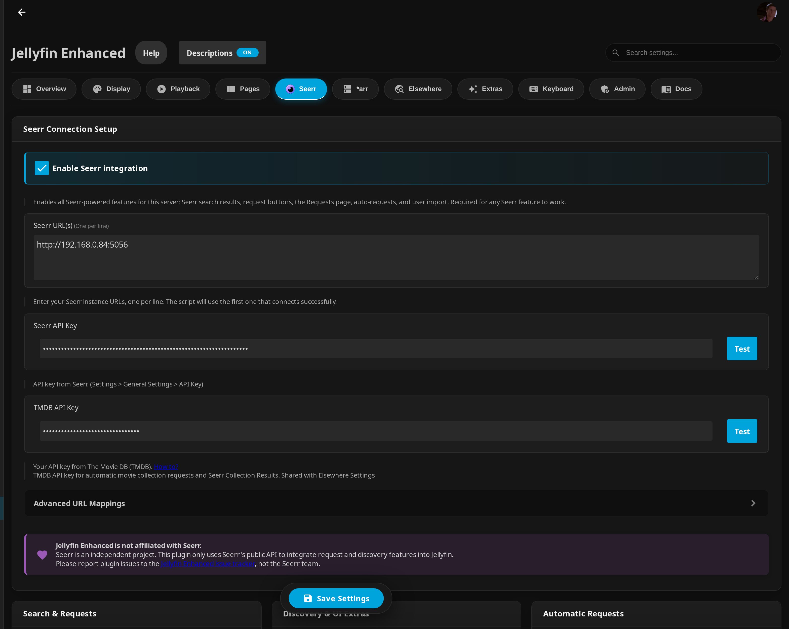

# Seerr Settings



!!! info "Prerequisites"

    **Prerequisites:**

    - Seerr instance
      - **API key**
      - Jellyfin Sign-In enabled

!!! warning "Disclaimer"

    **This plugin is NOT affiliated with Seerr.** Seerr is an independent project.

    **Please report plugin issues to the Jellyfin Enhanced repository, not to the Seerr team.**

## Setup

### Step 1: Enable Jellyfin Sign-In in Seerr

1. In Seerr, go to **Settings** → **Users**
2. Enable **"Enable Jellyfin Sign-In"**
3. Save settings


### Step 2: Import Jellyfin Users

This step is optional if you enable plugin-side auto import.

1. In Seerr, go to **Users** page
2. Click **"Import Jellyfin Users"**
3. Select users to import
4. Save changes

**User Access:**

- Users WITH access:

  

- Users WITHOUT access:

  

### Step 3: Configure Plugin

1. Go to **Dashboard** → **Plugins** → **Jellyfin Enhanced**
2. Navigate to **Seerr** tab
3. In **Seerr Connection Setup**, check **"Enable Seerr integration"**
   - This is the master switch. It is required for any Seerr feature (search results, request buttons, the Requests page, auto-requests, and user import) to work.
4. Enter your **Seerr URL(s)** (one per line)
   - Use an internal/LAN URL for best performance
   - You can provide multiple URLs; the script uses the first one that connects successfully
5. Enter your **Seerr API Key**
   - Found in Seerr: **Settings** → **General Settings** → **API Key**
6. Optional: Enter a **TMDB API Key**
   - Used for automatic movie collection requests and Seerr collection results, and is required for the "Show Streaming Providers on Posters" option
   - This key is shared with the **Elsewhere** settings
   - Get one from [TMDB API settings](https://www.themoviedb.org/settings/api)
7. Click **Test** beside the API Key fields to verify connectivity
8. Enable optional features (see below)
9. Click **Save**

#### Advanced URL Mappings

Under **Seerr Connection Setup** there is an **Advanced URL Mappings** section (collapsed by default). Use it when users reach Jellyfin through more than one address (for example a local LAN address and a remote reverse-proxy hostname) and you want each one to open the matching Seerr address.

- **Field:** Seerr URL Mappings
- **Format:** `JellyfinURL|SeerrURL`, one mapping per line
- When a user clicks a result that links to Seerr (used by "Link result titles to Seerr instead of TMDB"), the plugin picks the Seerr URL whose Jellyfin side matches the address the user is currently on.
- If no mapping matches, or the field is empty, the first URL from the **Seerr URL(s)** list is used.

Examples:

```
# Remote access
https://jellyfin.mydomain.com|https://jellyseerr.mydomain.com

# Local access
http://192.168.1.10:8096|http://192.168.1.10:5055

# With base URL
https://example.com/jellyfin|https://example.com/jellyseerr
```

!!! tip
    Use the **Validate Mappings** button to check your mappings before saving.

!!! info "Mobile clients"
    Add mappings for every address users open Jellyfin from. Without the correct mapping, mobile clients may fail to open Seerr links.

### Step 4: Configure User Import (Optional)

Enable automatic import in the plugin if you do not want to manually import users in Seerr.

When enabled, new Jellyfin users are automatically imported into Seerr the first time they use Seerr Search.

1. Go to **Dashboard** → **Plugins** → **Jellyfin Enhanced**
2. Navigate to **Seerr** tab
3. In the **Users** section, check **"Auto import Jellyfin users to Seerr"**
4. Optional: expand **Blocked users** and select users to exclude
5. Optional: click **Import Users Now** to run immediate bulk import
6. Click **Save**

!!! tip
    The scheduled task **Import Jellyfin Users to Seerr** runs every 6 hours by default when auto import is enabled.
    You can change the trigger in Jellyfin Dashboard -> Scheduled Tasks.

## Search & Requests

These options live under the **Search & Requests** section of the Seerr tab.

### Show Seerr Results in Search
- Enhances Jellyfin search by showing results from Seerr.
- Lets users discover and request missing movies and shows directly from Jellyfin.

### Show Collections in Seerr Results
- Displays TMDB collections (e.g., Harry Potter, Marvel Cinematic Universe) in Seerr search results, with an option to request the entire collection at once.
- Enabled by default.

### Enable 4K Requests
!!! note "Requirements"

    - Seerr instance with **4K (Radarr) configuration**
    - Users must have permission to request 4K quality in Seerr

- When enabled, movie request buttons include a dropdown to request a 4K version.

### Enable 4K TV Requests
!!! note "Requirements"

    - Seerr instance with **4K Sonarr configured**
    - Users must have permission to request **4K Sonarr** quality in Seerr

  When enabled, TV request buttons include a dropdown that opens the season request modal in 4K mode.

### Show Advanced Request Options
- Lets users choose between Servers, Quality profiles, and Paths while requesting.
- Note: enabling this disregards any Override Rules set in Seerr.

### Show Request Quota Info
- Enabled by default.
- Request modals display a chip showing the user's request usage and when their next slot frees up.
- Quota errors are shown in a detailed dialog instead of a vanishing toast.

## Discovery & UI Extras

These options live under the **Discovery & UI Extras** section.

### Open Results in "More Info" Modal
- When enabled, clicking a Seerr result title or poster opens an in-app More Info modal.
- When disabled, clicking opens the item in Seerr.

### Show "Report Issue" Button on Items
- Adds a small report icon to item action icons, letting users report playback/content issues (video, audio, subtitle, or other) to Seerr.

### Show Open Issue Indicator
- When enabled, the report issue button turns orange and shows a count badge if the item has open issues in Seerr.

### Show Streaming Providers on Posters
- Displays icons of available streaming services (from your default region) on Seerr posters.

!!! note "Requirements"
    Requires a **TMDB API Key** to be configured (shared with the **Elsewhere** settings; it is the same key entered in the Connection Setup above). Without a TMDB key this option is disabled in the UI.

!!! info "Reviews / streaming-on-Seerr note"
    This option shows where a title is **available to stream** (the streaming providers), not user reviews. The provider icons are sourced from TMDB for your configured default region. Items already in your library still show their providers so users can tell what is streamable elsewhere.

#### Item Pages Discovery (collapsible)

- **Show similar items** — similar movies/shows from Seerr on item detail pages (max 20). Enabled by default.
- **Show recommended items** — recommended movies/shows on item detail pages (max 20). Enabled by default.
- **Show "Request More" button on Series** — adds a "Request More" button beside the Seasons heading on Series pages when the show has unrequested seasons in Seerr. Enabled by default.
- **Exclude items already in library** — hides similar/recommended items already in your Jellyfin library. Enabled by default. If disabled, available items link to the library item instead.
- **Exclude blocklisted items** — hides items marked blocklisted in Seerr from similar/recommended suggestions. Disabled by default.

#### "More" Discovery (collapsible)

All enabled by default:

- **Show "More from Network"** — extra content from a network (e.g., Netflix, HBO) when viewing its page.
- **Show "More Genre"** — extra content in a genre when viewing a genre page.
- **Show "More Tag"** — extra content with a keyword when viewing a tag page.
- **Show "More from Actor"** — an actor's filmography (including titles not in your library) on person pages.
- **Show missing collection movies** — on a collection/BoxSet page, shows collection movies not yet in your library with request buttons.

## Automatic Requests

These options live under the **Automatic Requests** section, split into two collapsible groups.

### Auto Season Requests

- **Enable Automatic Advance Season Requests** — automatically requests the next season in Seerr when a user is about to finish the current one.
- **Require All Prior Episodes Watched** — require all episodes before the threshold to be watched/marked watched before a request triggers. Prevents accidental triggers from jumping to later episodes (may also suppress requests for users who skip episodes).
- **Episodes Remaining Threshold** — request the next season when unwatched episodes are at or below this number. Default: **2**. Range 1–20.
  - Requests trigger when users start or complete episodes.
  - If one user has already triggered a season's request, it won't be re-requested when another user hits the threshold.

### Auto Movie Requests

!!! note "Requirements"
    A **TMDB API key** must be configured. Auto Movie Requests only work for movies that are part of a TMDB collection, and request the next movie in that collection by release order. Movies already available or requested are skipped.

- **Enable Auto Movie Requests** — automatically requests the next movie in a collection based on the triggers below.
- **Request Triggers** (select one or both; either condition triggers):
  - **When movie starts** — request as soon as a user starts a movie.
  - **After X minutes watched** — request once the user has watched the threshold below.
- **Minutes Watched Threshold** — minutes watched before triggering. Default: **20**. Range 1–180.
- **Only request if released** — when enabled, future releases are skipped; only already-released movies are requested. Enabled by default.
- **Quality Profile Mode** — Default / Original / Custom:
  - **Default** — Seerr uses its default Radarr server and quality profile.
  - **Original** — uses the same quality profile as the movie being watched (falls back to default if not found).
  - **Custom** — always uses the specific Radarr server, quality profile, and root folder selected (the **Radarr Server / Quality Profile / Root Folder** dropdowns appear only in this mode).
- **Use default instead of 4K fallback** — only applies in **Original** mode. If the watched movie used a 4K profile, the auto-request uses Seerr's default profile instead, avoiding failures/manual approval for users without 4K permissions. Enabled by default. Disable only if all users have 4K request access and you want to preserve the 4K profile.

## Recently Added Sync to Seerr

Found under the **Recently Added Sync to Seerr** section.

### Trigger Seerr Recently-Added Scan on Item Added
- When Jellyfin reports new library items, this triggers Seerr's "Jellyfin Recently Added Scan" job immediately, so request statuses update without waiting for Seerr's next scheduled run.
- Events are debounced, so a bulk import collapses into a single trigger.
- Disabled by default.

!!! tip
    With this enabled, you can set Seerr's recently-added scan frequency to a much longer interval (e.g., 60 minutes) to reduce noise.

### Debounce (seconds)
- Wait this many seconds after the **last** item is added before firing the scan. Default: **60**. Range 5–3600.

### Trigger Scan Now
- The **Trigger scan now** button runs the scan immediately, using the Seerr URL and API key from the Connection Setup section (first reachable URL if several are configured).

## Watchlist

Found under the **Watchlist** section.

!!! note "Companion plugin required"
    Watchlist sync relies on the **[KefinTweaks](https://github.com/ranaldsgift/KefinTweaks)** companion plugin (formerly "Jellyfin Tweaks") to render and read the Jellyfin-side watchlist UI. The config page shows a "KefinTweaks detected" badge when it is installed.

### Add Requested Media to Watchlist
- When enabled, any media requested through Seerr Search via Jellyfin Enhanced is automatically added to the requesting user's watchlist.
- Disabled by default. Requires KefinTweaks to view the watchlisted items.

### Sync Seerr Watchlist → Jellyfin
- Automatically syncs items from each user's Seerr watchlist to their Jellyfin watchlist.
- Disabled by default. Requires KefinTweaks to render the watchlist UI.
- Configure how often it runs in **Jellyfin Dashboard → Scheduled Tasks → "Sync Watchlist from Seerr to Jellyfin"** (default trigger: daily at **03:00**).

### Sync Jellyfin Watchlist → Seerr
- Automatically syncs items from a user's Jellyfin watchlist (from KefinTweaks) to their Seerr watchlist.
- Disabled by default. Requires users to have a linked Seerr account.
- Configure how often it runs in **Jellyfin Dashboard → Scheduled Tasks → "Sync Watchlist from Jellyfin to Seerr"** (default trigger: daily at **03:30**).

### Prevent Re-adding Removed Items
- Enabled by default. Items are added to a user's watchlist only once; if a user manually removes an item, it won't be auto-re-added during future syncs.

### Memory Retention (days)
- How long the plugin remembers that an item was processed before allowing it to be re-added. Default: **365**. Range 1–3650.
- After this period, manually removed (and still unwatched) items may be re-added if they're still in the user's Seerr requests or Seerr watchlist.
- Only applies when **Prevent re-adding removed items** is enabled (the field is hidden otherwise).
- Examples: 30 days = re-addable after a month; 365 days = one year (recommended); 3650 days = ~permanent.

## User Import

Found under the **Users** section. See also [Step 4](#step-4-configure-user-import-optional) above.

### Auto Import Jellyfin Users to Seerr
- Automatically imports Jellyfin users into Seerr so they can use Seerr Search without visiting Seerr directly.
- New users are imported the first time they use Seerr Search (just-in-time); a scheduled task also bulk-imports periodically.
- Already-imported users are skipped.
- Disabled by default.

### Blocked Users
- Expand **Blocked Users** to select Jellyfin users to exclude from import.
- Blocked users are never looked up or imported; no Seerr API calls are made for them.

### Import Users Now
- Runs an immediate one-off bulk import of all (non-blocked) Jellyfin users.

!!! tip "Changing the import schedule"
    The bulk import runs as the **Import Jellyfin Users to Seerr** scheduled task (default trigger: every **6 hours**, and only while auto-import is enabled). Change the trigger in **Jellyfin Dashboard → Scheduled Tasks**.

## Caching / Debug

Found under the **Debug** section. These rarely need changing.

### Disable Server-Side Response Cache
- When enabled, every Seerr proxy request bypasses the server-side cache and is fetched fresh from Seerr. Useful for testing but increases load on your Seerr instance. Disabled by default. **Not recommended for normal use.**

### Response Cache TTL (min)
- How long Seerr API responses (search, discovery, recommendations) are cached. Default: **10** minutes. Minimum 1.

### User ID Cache TTL (min)
- How long the Jellyfin → Seerr user ID mapping is cached. Default: **30** minutes. Minimum 1.

## Requests Page Management

!!! info "These settings live on the Pages tab"
    The **Requests Page** is configured in the **Pages** tab (not the Seerr tab), but it surfaces Seerr requests/issues, so it is documented here for completeness.

### Enable Requests Page

Displays a dedicated page showing active downloads from *arr and requests from Seerr.

**Configuration:**

1. Go to **Dashboard** → **Plugins** → **Jellyfin Enhanced**
2. Navigate to the **Pages** tab and find the **Requests Page** section
3. Check **"Enable Requests Page"**
4. Choose an integration method:
   - **Use Plugin Pages** - Adds a sidebar link (requires the [Plugin Pages](https://github.com/IAmParadox27/jellyfin-plugin-pages) plugin)
   - **Use Custom Tabs** - Adds a custom tab (requires the [Custom Tabs](https://github.com/IAmParadox27/jellyfin-plugin-custom-tabs) plugin)
5. Click **Save** and restart Jellyfin if using Plugin Pages

### Show Downloads in Requests Page

Controls whether active downloads from Sonarr/Radarr appear on the Requests page.

- Enabled by default - shows active downloads alongside requests and issues
- Requires *arr integration to be configured
- Can be toggled independently

### Show Seerr Issues Section

Displays Seerr issues on the Requests page (disabled by default).

- View reported issues
- Link to the Seerr reporter modal

### Auto-Refresh Settings

- **Enable Auto-Refresh** - automatically refreshes download and request status (enabled by default)
- **Poll Interval (seconds)** - how often to refresh. Default: **30**. Range 30–300.
  - Lower = more frequent updates (higher server load)
  - Higher = less frequent updates (lower server load)